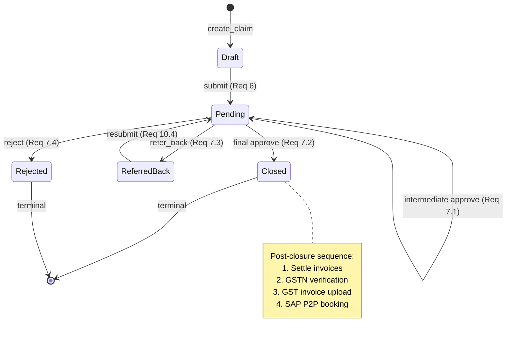
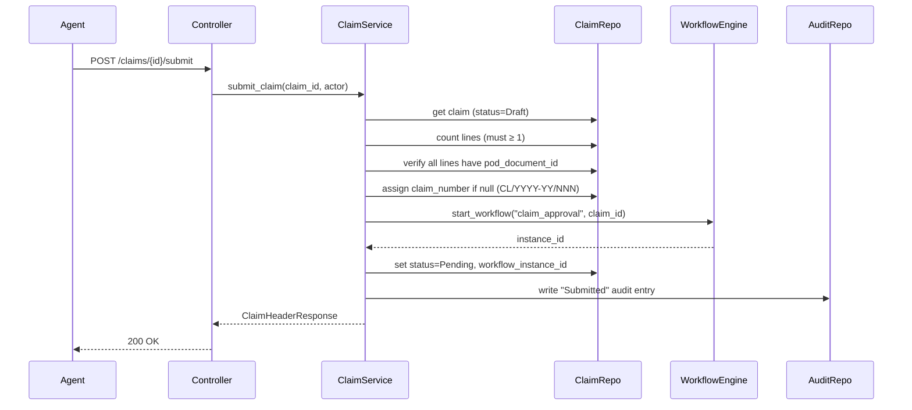
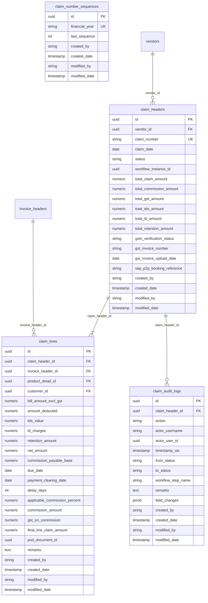

# Design Document: Commission Claim Management

## Overview

The Commission Claim Management feature enables Liaisoning Agents (Vendors) to raise
commission claims against payment-cleared invoices. The system auto-calculates commission
via a 7-step formula driven by Agreement Master slab rules, routes each claim through the
existing configurable WorkflowEngine, and closes the claim once all approvals complete —
settling covered invoices and recording an SAP P2P booking reference.

The feature follows Clean Architecture: domain entities and pure business logic live in the
domain layer, orchestration in the application service, persistence in infrastructure
repositories, and HTTP concerns in the thin API controller. All cross-cutting concerns
(RBAC, audit, workflow) use existing platform services.

### Research Findings

- **WorkflowEngine** (`src/application/services/workflow/workflow_engine.py`) exposes
  `start_workflow()`, `execute_action()`, `get_available_actions()`, `get_workflow_status()`
  and `get_pending_tasks()`. Claims plug in via `entity_type="commission_claim"`.
- **AgreementModel** has `slab_in_days`, `reduction_percent`, `max_commission_percent`,
  `min_commission_percent`, `credit_days`, `from_date`, `to_date` — all inputs needed by
  the 7-step formula.
- **InvoiceHeaderModel** has `invoice_status`, `vendor_id`, `customer_id`, `invoice_date`,
  `bill_amount_excl_gst`, `payment_clearing_date`, `amount_deducted`, `tds_value`.
- **BaseModel** provides `id` (UUID PK), `created_by`, `created_date`, `modified_by`,
  `modified_date` via `AuditMixin`.
- **VendorModel** has `gstn_number` (String 15) — used for GSTN validation at closure.
- **Hypothesis 6.155.2** is already a dev dependency in `pyproject.toml`.
- Frontend masters pattern: `api/`, `models/`, `schemas/`, `hooks/`, `components/`,
  `pages/`, `routes/` — all using React Query + Zod + `@tanstack/react-query`.

---

## Architecture

### Clean Architecture Layer Map

```
┌──────────────────────────────────────────────────────────────────────────┐
│  API Layer  (src/api/v1/endpoints/commission_claim/)                     │
│  controller.py — thin FastAPI router; delegates to CommissionClaimService│
│  schemas.py    — Pydantic v2 request / response models                   │
│  require_permission() FastAPI Depends on every endpoint                  │
└────────────────────────────────┬─────────────────────────────────────────┘
                                 │ calls
┌────────────────────────────────▼─────────────────────────────────────────┐
│  Application Layer  (src/application/services/)                          │
│  CommissionClaimService — orchestrates all use-cases                     │
│   • invoice pre-condition validation                                     │
│   • commission trigger & header-totals maintenance (in UoW)              │
│   • claim-number generation (DB advisory lock)                           │
│   • workflow integration (WorkflowEngine calls)                          │
│   • post-closure sequence (invoice settlement, GSTN, SAP)               │
│   • audit writes (ClaimAuditRepository)                                  │
└───────────┬─────────────────┬──────────────────────┬────────────────────┘
            │ uses            │ calls                 │ calls
┌───────────▼──────────┐  ┌──▼────────────────────┐  ┌▼──────────────────┐
│  Domain Layer         │  │  WorkflowEngine        │  │  AuditService     │
│  ClaimHeader entity   │  │  (existing)            │  │  (existing)       │
│  ClaimLine entity     │  └───────────────────────┘  └───────────────────┘
│  CommissionCalculator │
│  ClaimStatus enum     │
│  State machine map    │
│  IClaimRepository     │
│  IClaimLineRepository │
│  IClaimAuditRepository│
└───────────┬───────────┘
            │ implemented by
┌───────────▼──────────────────────────────────────────────────────────────┐
│  Infrastructure Layer  (src/infrastructure/database/)                    │
│  ClaimHeaderModel     (table: claim_headers)                             │
│  ClaimLineModel       (table: claim_lines)                               │
│  ClaimAuditLogModel   (table: claim_audit_logs)                          │
│  ClaimHeaderRepositoryImpl / ClaimLineRepositoryImpl                     │
│  ClaimAuditRepositoryImpl / ClaimNumberSequenceService                   │
└──────────────────────────────────────────────────────────────────────────┘
```

### Integration Points with Existing Services

| Service | How it integrates |
|---|---|
| `WorkflowEngine` | `start_workflow("claim_approval", "commission_claim", claim_id, ...)` on submit; `execute_action(instance_id, action_code, ...)` on approve/reject/refer-back |
| `require_permission()` | FastAPI dependency on every endpoint; no hardcoded role names |
| `AuditService` (manual) | Called for domain-level events: Create, Line Added/Edited, Submitted, Approved, etc. |
| `audit_listener.py` (auto) | Fires on every INSERT/UPDATE/DELETE on claim tables — provides low-level field diff |
| `UnitOfWork` | Claim line changes + header-total recalculation happen in a single DB transaction |
| `InvoiceHeaderModel` | Read to validate pre-conditions; updated to `Settled` at closure |
| `AgreementModel` | Queried to resolve slab parameters for commission calculation |
| `VendorModel` | `gstn_number` read at post-closure GSTN validation step |

### State Machine Diagram



### Claim Submit Sequence



---

## Components and Interfaces

### Domain Entities

```python
# src/domain/entities/commission_claim.py

from dataclasses import dataclass, field
from datetime import date, datetime
from decimal import Decimal
from enum import Enum
from uuid import UUID


class ClaimStatus(str, Enum):
    Draft = "Draft"
    Pending = "Pending"
    ReferredBack = "Referred Back"
    Rejected = "Rejected"
    Closed = "Closed"


# Allowed transitions: (from_status, action) -> to_status
CLAIM_TRANSITIONS: dict[tuple[ClaimStatus, str], ClaimStatus] = {
    (ClaimStatus.Draft,       "submit"):     ClaimStatus.Pending,
    (ClaimStatus.Pending,     "approve"):    ClaimStatus.Pending,   # intermediate
    (ClaimStatus.Pending,     "final_approve"): ClaimStatus.Closed,
    (ClaimStatus.Pending,     "refer_back"): ClaimStatus.ReferredBack,
    (ClaimStatus.Pending,     "reject"):     ClaimStatus.Rejected,
    (ClaimStatus.ReferredBack,"submit"):     ClaimStatus.Pending,
}

TERMINAL_STATUSES: frozenset[ClaimStatus] = frozenset({
    ClaimStatus.Closed,
    ClaimStatus.Rejected,
})


@dataclass
class ClaimHeader:
    id: UUID
    vendor_id: UUID
    claim_number: str | None          # null until first submission
    claim_date: date
    status: ClaimStatus
    workflow_instance_id: UUID | None
    total_claim_amount: Decimal
    total_commission_amount: Decimal
    total_gst_amount: Decimal
    total_tds_amount: Decimal
    total_ld_amount: Decimal
    total_retention_amount: Decimal
    gstn_verification_status: str     # Pending / Verified / Failed
    gst_invoice_number: str | None
    gst_invoice_upload_date: date | None
    sap_p2p_booking_reference: str | None
    created_by: str
    created_date: datetime
    modified_by: str
    modified_date: datetime


@dataclass
class ClaimLine:
    id: UUID
    claim_header_id: UUID
    invoice_header_id: UUID
    product_detail_id: UUID
    customer_id: UUID
    bill_amount_excl_gst: Decimal
    amount_deducted: Decimal
    tds_value: Decimal
    ld_charges: Decimal
    retention_amount: Decimal
    # Calculated fields (7-step formula)
    net_amount: Decimal
    commission_payable_base: Decimal
    due_date: date
    payment_clearing_date: date
    delay_days: int
    applicable_commission_percent: Decimal
    commission_amount: Decimal
    gst_on_commission: Decimal
    final_line_claim_amount: Decimal
    # Non-formula display fields
    pod_document_id: UUID | None
    remarks: str
    created_by: str
    created_date: datetime
    modified_by: str
    modified_date: datetime
```

### Repository Interfaces

```python
# src/domain/repositories/commission_claim/

class IClaimHeaderRepository(ABC):
    async def get_by_id(self, claim_id: UUID) -> ClaimHeader | None: ...
    async def create(self, header: ClaimHeader) -> ClaimHeader: ...
    async def update(self, header: ClaimHeader) -> ClaimHeader: ...
    async def list_by_vendor(self, vendor_id: UUID, skip: int, limit: int) -> tuple[list[ClaimHeader], int]: ...
    async def list_all(self, filters: ClaimFilterParams, skip: int, limit: int) -> tuple[list[ClaimHeader], int]: ...
    async def list_pending_for_user(self, user_id: UUID) -> list[ClaimHeader]: ...
    async def get_next_sequence(self, financial_year: str) -> int: ...  # DB-locked

class IClaimLineRepository(ABC):
    async def get_by_id(self, line_id: UUID) -> ClaimLine | None: ...
    async def list_by_claim(self, claim_id: UUID) -> list[ClaimLine]: ...
    async def create(self, line: ClaimLine) -> ClaimLine: ...
    async def update(self, line: ClaimLine) -> ClaimLine: ...
    async def delete(self, line_id: UUID) -> None: ...
    async def sum_totals(self, claim_id: UUID) -> ClaimTotals: ...

class IClaimAuditRepository(ABC):
    async def create(self, entry: ClaimAuditEntry) -> ClaimAuditEntry: ...
    async def list_by_claim(self, claim_id: UUID) -> list[ClaimAuditEntry]: ...
```

### CommissionCalculator — Extended Interface

```python
# src/domain/services/commission_calculator.py  (extend existing)

@dataclass
class CommissionInputs:
    bill_amount_excl_gst: Decimal
    amount_deducted: Decimal
    tds_value: Decimal
    invoice_date: date
    due_date: date
    payment_clearing_date: date
    slab_in_days: int
    reduction_percent: Decimal
    max_commission_percent: Decimal
    min_commission_percent: Decimal

@dataclass
class CommissionResult:
    net_amount: Decimal
    commission_payable_base: Decimal
    delay_days: int
    applicable_commission_percent: Decimal
    commission_amount: Decimal
    gst_on_commission: Decimal
    final_line_claim_amount: Decimal

def calculate(inputs: CommissionInputs) -> CommissionResult:
    """Execute all 7 formula steps. Pure function — no I/O."""
    ...
```

---

## Data Models

### ER Diagram



### SQLAlchemy Models

#### ClaimHeaderModel

```python
# src/infrastructure/database/models/commission_claim/commission_claim_model.py

class ClaimHeaderModel(BaseModel):
    __tablename__ = "claim_headers"

    vendor_id: Mapped[str] = mapped_column(UUID(as_uuid=True), ForeignKey("vendors.id"), nullable=False, index=True)
    claim_number: Mapped[str | None] = mapped_column(String(20), unique=True, nullable=True, index=True)
    claim_date: Mapped[date] = mapped_column(Date, nullable=False)
    status: Mapped[str] = mapped_column(String(30), nullable=False, default="Draft", index=True)
    workflow_instance_id: Mapped[str | None] = mapped_column(UUID(as_uuid=True), nullable=True)
    # Header totals (persisted, recalculated on every line change)
    total_claim_amount: Mapped[Decimal] = mapped_column(Numeric(16, 2), nullable=False, default=Decimal("0"))
    total_commission_amount: Mapped[Decimal] = mapped_column(Numeric(16, 2), nullable=False, default=Decimal("0"))
    total_gst_amount: Mapped[Decimal] = mapped_column(Numeric(16, 2), nullable=False, default=Decimal("0"))
    total_tds_amount: Mapped[Decimal] = mapped_column(Numeric(16, 2), nullable=False, default=Decimal("0"))
    total_ld_amount: Mapped[Decimal] = mapped_column(Numeric(16, 2), nullable=False, default=Decimal("0"))
    total_retention_amount: Mapped[Decimal] = mapped_column(Numeric(16, 2), nullable=False, default=Decimal("0"))
    # Post-closure fields
    gstn_verification_status: Mapped[str] = mapped_column(String(20), nullable=False, default="Pending")
    gst_invoice_number: Mapped[str | None] = mapped_column(String(100), nullable=True)
    gst_invoice_upload_date: Mapped[date | None] = mapped_column(Date, nullable=True)
    sap_p2p_booking_reference: Mapped[str | None] = mapped_column(String(100), nullable=True)
    # Relationships
    lines: Mapped[list["ClaimLineModel"]] = relationship("ClaimLineModel", back_populates="header",
        cascade="all, delete-orphan", passive_deletes=True, lazy="selectin")
    audit_logs: Mapped[list["ClaimAuditLogModel"]] = relationship("ClaimAuditLogModel",
        back_populates="header", lazy="dynamic")
    __table_args__ = (
        Index("ix_claim_headers_vendor_status", "vendor_id", "status"),
    )
```

#### ClaimLineModel

```python
class ClaimLineModel(BaseModel):
    __tablename__ = "claim_lines"

    claim_header_id: Mapped[str] = mapped_column(UUID(as_uuid=True), ForeignKey("claim_headers.id", ondelete="CASCADE"), nullable=False, index=True)
    invoice_header_id: Mapped[str] = mapped_column(UUID(as_uuid=True), ForeignKey("invoice_headers.id"), nullable=False, index=True)
    product_detail_id: Mapped[str] = mapped_column(UUID(as_uuid=True), ForeignKey("product_master.id"), nullable=False)
    customer_id: Mapped[str] = mapped_column(UUID(as_uuid=True), ForeignKey("customers.id"), nullable=False)
    # Invoice-sourced inputs
    bill_amount_excl_gst: Mapped[Decimal] = mapped_column(Numeric(14, 2), nullable=False)
    amount_deducted: Mapped[Decimal] = mapped_column(Numeric(14, 2), nullable=False, default=Decimal("0"))
    tds_value: Mapped[Decimal] = mapped_column(Numeric(14, 2), nullable=False, default=Decimal("0"))
    ld_charges: Mapped[Decimal] = mapped_column(Numeric(14, 2), nullable=False, default=Decimal("0"))
    retention_amount: Mapped[Decimal] = mapped_column(Numeric(14, 2), nullable=False, default=Decimal("0"))
    # 7-step formula outputs (all persisted for audit)
    net_amount: Mapped[Decimal] = mapped_column(Numeric(14, 2), nullable=False, default=Decimal("0"))
    commission_payable_base: Mapped[Decimal] = mapped_column(Numeric(14, 2), nullable=False, default=Decimal("0"))
    due_date: Mapped[date] = mapped_column(Date, nullable=False)
    payment_clearing_date: Mapped[date] = mapped_column(Date, nullable=False)
    delay_days: Mapped[int] = mapped_column(Integer, nullable=False, default=0)
    applicable_commission_percent: Mapped[Decimal] = mapped_column(Numeric(7, 4), nullable=False, default=Decimal("0"))
    commission_amount: Mapped[Decimal] = mapped_column(Numeric(14, 2), nullable=False, default=Decimal("0"))
    gst_on_commission: Mapped[Decimal] = mapped_column(Numeric(14, 2), nullable=False, default=Decimal("0"))
    final_line_claim_amount: Mapped[Decimal] = mapped_column(Numeric(14, 2), nullable=False, default=Decimal("0"))
    # POD & remarks
    pod_document_id: Mapped[str | None] = mapped_column(UUID(as_uuid=True), nullable=True)
    remarks: Mapped[str] = mapped_column(Text, nullable=False, default="")
    # Relationship
    header: Mapped["ClaimHeaderModel"] = relationship("ClaimHeaderModel", back_populates="lines")
    __table_args__ = (
        UniqueConstraint("claim_header_id", "invoice_header_id", name="uq_claim_line_invoice"),
        Index("ix_claim_lines_header", "claim_header_id"),
    )
```

#### ClaimAuditLogModel

```python
class ClaimAuditLogModel(BaseModel):
    __tablename__ = "claim_audit_logs"

    claim_header_id: Mapped[str] = mapped_column(UUID(as_uuid=True), ForeignKey("claim_headers.id"), nullable=False, index=True)
    action: Mapped[str] = mapped_column(String(50), nullable=False)
    actor_username: Mapped[str] = mapped_column(String(255), nullable=False)
    actor_user_id: Mapped[str] = mapped_column(UUID(as_uuid=True), nullable=False)
    timestamp_utc: Mapped[datetime] = mapped_column(DateTime(timezone=True), nullable=False, default=lambda: datetime.now(timezone.utc))
    from_status: Mapped[str | None] = mapped_column(String(30), nullable=True)
    to_status: Mapped[str | None] = mapped_column(String(30), nullable=True)
    workflow_step_name: Mapped[str | None] = mapped_column(String(100), nullable=True)
    remarks: Mapped[str | None] = mapped_column(Text, nullable=True)
    field_changes: Mapped[dict | None] = mapped_column(JSONB, nullable=True)  # {"field": {"old": ..., "new": ...}}
    header: Mapped["ClaimHeaderModel"] = relationship("ClaimHeaderModel", back_populates="audit_logs")
    __table_args__ = (
        Index("ix_claim_audit_logs_header_ts", "claim_header_id", "timestamp_utc"),
    )
```

#### ClaimNumberSequenceModel

```python
class ClaimNumberSequenceModel(BaseModel):
    __tablename__ = "claim_number_sequences"

    financial_year: Mapped[str] = mapped_column(String(10), unique=True, nullable=False)  # "2025-26"
    last_sequence: Mapped[int] = mapped_column(Integer, nullable=False, default=0)
    __table_args__ = (
        Index("ix_claim_number_seq_fy", "financial_year", unique=True),
    )
```

---

## Correctness Properties

*A property is a characteristic or behavior that should hold true across all valid executions of a system — essentially, a formal statement about what the system should do. Properties serve as the bridge between human-readable specifications and machine-verifiable correctness guarantees.*

**Property Reflection:** After reviewing all testable criteria, the following consolidation was applied:
- Req 3.2 (net_amount floor) subsumes Req 22.1 (net_amount ≥ 0) — the floor formula implies non-negativity.
- Req 3.8 + 3.9 (GST=18%, final=commission+GST) together subsume Req 22.7 (final=commission×1.18) — combined into one round-trip property.
- Req 11.3/11.4 (terminal states block transitions) subsumes Req 22.9 (terminal-state idempotence) — same invariant.
- Req 2.1 settled-invoice rejection subsumes Req 22.10 — same property.
- Req 3.3 (commission_payable_base identity) and the special case Req 22.3 (base=bill when deducted/tds=0) can be combined into a single algebraic identity property.
- Req 11.1 (only listed transitions) and Req 22.8 (status stays in valid set) are complementary and kept separate because they test different things: transition gating vs. output set membership.

### Property 1: Net Amount Floor Invariant

*For any* non-negative `bill_amount_excl_gst`, `amount_deducted`, and `tds_value`, the
`CommissionCalculator` SHALL produce `net_amount = max(0, bill_amount_excl_gst − amount_deducted − tds_value)`,
meaning `net_amount` is always ≥ 0 and equals the formula result when positive.

**Validates: Requirements 3.2, 22.1**

### Property 2: Commission Payable Base Identity

*For any* non-negative inputs, the `CommissionCalculator` SHALL produce
`commission_payable_base = net_amount + tds_value + amount_deducted`.
As a corollary, when `amount_deducted = 0` and `tds_value = 0`,
`commission_payable_base = bill_amount_excl_gst`.

**Validates: Requirements 3.3, 22.2, 22.3**

### Property 3: On-Time Payment Receives Maximum Commission

*For any* inputs where `payment_clearing_date ≤ due_date` (i.e., `delay_days ≤ 0`),
the `CommissionCalculator` SHALL produce
`applicable_commission_percent = max_commission_percent`.

**Validates: Requirements 3.5, 22.4**

### Property 4: Commission Percent Floor — Delayed Payments

*For any* inputs where `payment_clearing_date > due_date` and `slab_in_days > 0`,
the `CommissionCalculator` SHALL produce
`min_commission_percent ≤ applicable_commission_percent ≤ max_commission_percent`.

**Validates: Requirements 3.6, 22.5, 22.6**

### Property 5: GST Round-Trip — Final Amount Equals Commission × 1.18

*For any* valid `CommissionInputs`, the `CommissionCalculator` SHALL produce:
- `gst_on_commission = commission_amount × 0.18` (fixed, non-overridable), and
- `final_line_claim_amount = commission_amount × 1.18`

(i.e., `final_line_claim_amount = commission_amount + gst_on_commission` and the
18% GST rate is never alterable).

**Validates: Requirements 3.8, 3.9, 22.7**

### Property 6: Header Totals Equal Sum of Lines

*For any* Claim Header and any set of Claim Lines belonging to it, after any line
add/update/delete operation, the following SHALL hold:
`header.total_claim_amount = Σ line.final_line_claim_amount` (and similarly for the
other five aggregate fields: commission, GST, TDS, LD, retention).

**Validates: Requirements 4.1, 4.2**

### Property 7: Claim Number Format Invariant

*For any* first-time claim submission in any financial year, the assigned `claim_number`
SHALL match the pattern `CL/YYYY-YY/NNN` where `YYYY-YY` is the Indian financial year
and `NNN` is a zero-padded sequential counter (extending to 4+ digits beyond 999 per
Requirement 13.4). The claim number is immutable on all subsequent resubmissions.

**Validates: Requirements 6.2, 6.3, 13.1, 13.4**

### Property 8: Status Transition Gating

*For any* Claim Header and any action attempted on it, the resulting status SHALL be
in the set `{Draft, Pending, Referred Back, Closed, Rejected}`, and transitions that
are not in the allowed map SHALL be rejected with an error leaving the status unchanged.

**Validates: Requirements 11.1, 11.2, 22.8**

### Property 9: Terminal State Immutability

*For any* Claim Header in `Closed` or `Rejected` status, any attempt to perform any
status-changing action SHALL be rejected and the claim status SHALL remain unchanged.

**Validates: Requirements 11.3, 11.4, 22.9**

### Property 10: Settled Invoice Pre-Condition Rejection

*For any* invoice with `invoice_status = Settled`, attempting to add that invoice to
any claim SHALL be rejected with error `"Invoice is already settled."`, regardless
of any other invoice attributes.

**Validates: Requirements 2.1, 22.10**

### Property 11: Claim Number Null at Draft Creation

*For any* valid vendor-initiated claim creation, the resulting `ClaimHeader` SHALL
have `claim_number = None` until the first submission.

**Validates: Requirements 1.2, 6.3**

---

## Error Handling

| Scenario | HTTP Status | Error Detail |
|---|---|---|
| Missing `claims.*` permission | 403 | "Forbidden: missing permission `claims.create`" |
| Claim not found | 404 | "Claim not found" |
| Line not found | 404 | "Claim line not found" |
| Invoice already settled | 400 | "Invoice is already settled." |
| No active Vendor-Customer Mapping | 400 | "No active Vendor-Customer Mapping found for this invoice." |
| No active Agreement Master | 400 | "No active Agreement Master found for vendor + product on invoice date." |
| Duplicate invoice on same claim | 400 | "Invoice already added to this claim." |
| Payment clearing date < invoice date | 400 | "Payment Clearing Date cannot be earlier than Invoice Date." |
| Submit with no lines | 400 | "Claim must have at least one line before submission." |
| Submit with missing POD documents | 400 | "POD document missing for lines: [line_ids]" |
| Submit with no active workflow | 400 | "No active `claim_approval` workflow definition found." |
| Unauthorized actor for workflow action | 403 | "Not authorized to act on this claim at the current workflow step." |
| Empty remarks on approval action | 400 | "Remarks are required for this action." |
| Transition not allowed from current status | 400 | "Transition `{action}` is not allowed from status `{current_status}`." |
| Terminal status transition attempt | 400 | "Claim is in a terminal status and cannot be modified." |
| GSTN validation failure at closure | 200 (no block) | Sets `gstn_verification_status=Failed`; does not block closure, blocks GST invoice upload |
| GST invoice upload when GSTN not verified | 400 | "GSTN verification is required before uploading the GST invoice." |
| Sequence counter exceeds 999 | 200 (no error) | Counter extends to 4 digits naturally |
| User not original initiator on refer-back edit | 403 | "Only the original claim initiator or an Administrator can edit a Referred Back claim." |

### Error Propagation Strategy

- All `ValueError` raised by the service layer are caught by the controller and returned as `400 Bad Request`.
- Permission errors from `require_permission()` surface as `403 Forbidden` before the service is called.
- Database integrity violations (duplicate claim number, FK violations) bubble up as `500 Internal Server Error` with a correlation ID for traceability.
- The post-closure sequence (invoice settlement, GSTN check) runs in a single transaction; if the settlement step partially fails due to concurrent settlement, the service logs a warning and continues rather than rolling back (per Requirement 9.6).

---

## Application Service — CommissionClaimService

### Method Signatures

```python
# src/application/services/commission_claim_service.py

class CommissionClaimService:
    def __init__(self, session: AsyncSession, audit_service: AuditService, workflow_engine: WorkflowEngine): ...

    # ── Claim lifecycle ──────────────────────────────────────────────────────
    async def create_claim(self, vendor_id: UUID, actor: User) -> ClaimHeaderResponse: ...
    async def get_claim_detail(self, claim_id: UUID, actor: User) -> ClaimDetailResponse: ...
    async def list_claims(self, actor: User, filters: ClaimFilterParams, skip: int, limit: int) -> ClaimListResponse: ...

    # ── Line management ──────────────────────────────────────────────────────
    async def add_invoice_line(self, claim_id: UUID, invoice_id: UUID, overrides: LineOverrides, actor: User) -> ClaimLineResponse: ...
    async def update_line_fields(self, claim_id: UUID, line_id: UUID, fields: LineUpdateRequest, actor: User) -> ClaimLineResponse: ...
    async def remove_line(self, claim_id: UUID, line_id: UUID, actor: User) -> None: ...

    # ── Document management ──────────────────────────────────────────────────
    async def upload_pod(self, claim_id: UUID, line_id: UUID, document_id: UUID, actor: User) -> ClaimLineResponse: ...
    async def upload_gst_invoice(self, claim_id: UUID, gst_invoice_number: str, document_id: UUID, actor: User) -> ClaimHeaderResponse: ...

    # ── Workflow actions ─────────────────────────────────────────────────────
    async def submit_claim(self, claim_id: UUID, actor: User) -> ClaimHeaderResponse: ...
    async def execute_workflow_action(self, claim_id: UUID, action_code: str, remarks: str, actor: User) -> ClaimHeaderResponse: ...
    async def update_payment_clearing_date(self, claim_id: UUID, line_id: UUID, new_date: date, actor: User) -> ClaimLineResponse: ...
    async def record_sap_booking(self, claim_id: UUID, sap_reference: str, actor: User) -> ClaimHeaderResponse: ...

    # ── Views ────────────────────────────────────────────────────────────────
    async def get_approval_queue(self, actor: User, skip: int, limit: int) -> ApprovalQueueResponse: ...
    async def get_mis_pending(self, filters: MISFilterParams, skip: int, limit: int, actor: User) -> MISResponse: ...
    async def get_mis_history(self, filters: MISFilterParams, skip: int, limit: int, actor: User) -> MISResponse: ...
    async def export_mis(self, view: str, filters: MISFilterParams, actor: User) -> bytes: ...  # Excel bytes
    async def get_claim_audit(self, claim_id: UUID, actor: User) -> list[ClaimAuditEntry]: ...
```

### Claim Number Generation Logic

```python
async def _assign_claim_number(self, session: AsyncSession) -> str:
    """
    Generates the next claim number for the current Indian financial year.
    Uses a SELECT ... FOR UPDATE on claim_number_sequences to prevent races.
    Financial year: April 1 → March 31.
    Format: CL/YYYY-YY/NNN (extends to 4+ digits beyond 999).
    """
    today = date.today()
    # April–March financial year
    if today.month >= 4:
        fy = f"{today.year}-{str(today.year + 1)[2:]}"
    else:
        fy = f"{today.year - 1}-{str(today.year)[2:]}"

    # Acquire row-level lock on this financial year's sequence
    result = await session.execute(
        select(ClaimNumberSequenceModel)
        .where(ClaimNumberSequenceModel.financial_year == fy)
        .with_for_update()
    )
    seq_row = result.scalar_one_or_none()
    if seq_row is None:
        seq_row = ClaimNumberSequenceModel(financial_year=fy, last_sequence=0)
        session.add(seq_row)

    seq_row.last_sequence += 1
    # Zero-pad to 3 digits minimum; extend naturally for 1000+
    counter = str(seq_row.last_sequence).zfill(3)
    return f"CL/{fy}/{counter}"
```

### Header Totals Recalculation

Performed inside the same DB transaction as the line change:

```python
async def _recalculate_header_totals(self, claim_id: UUID, session: AsyncSession) -> None:
    totals = await self._line_repo.sum_totals(claim_id)
    header = await self._header_repo.get_by_id(claim_id)
    header.total_claim_amount      = totals.final_line_claim_amount
    header.total_commission_amount = totals.commission_amount
    header.total_gst_amount        = totals.gst_on_commission
    header.total_tds_amount        = totals.tds_value
    header.total_ld_amount         = totals.ld_charges
    header.total_retention_amount  = totals.retention_amount
    await self._header_repo.update(header)
```

### Post-Closure Sequence

```python
async def _run_post_closure(self, claim_id: UUID, actor: User, session: AsyncSession) -> None:
    lines = await self._line_repo.list_by_claim(claim_id)
    # 1. Settle invoices (skip already-settled, log warning)
    for line in lines:
        invoice = await session.get(InvoiceHeaderModel, str(line.invoice_header_id))
        if invoice.invoice_status == InvoiceStatus.Settled.value:
            logger.warning("Invoice %s already settled during closure", line.invoice_header_id)
            continue
        invoice.invoice_status = InvoiceStatus.Settled.value

    # 2. GSTN verification
    vendor = await session.get(VendorModel, str(claim.vendor_id))
    gstn = vendor.gstn_number or ""
    if re.fullmatch(r"[A-Z0-9]{15}", gstn):
        claim.gstn_verification_status = "Verified"
    else:
        claim.gstn_verification_status = "Failed"

    # 3. Email HO Finance (via notification service)
    await self._notification_service.notify_finance_closure(claim)
```

---

## API Layer — REST Endpoints

### Full Endpoint Table

| Method | Path | Permission | Description |
|---|---|---|---|
| POST | `/api/v1/claims` | `claims.create` | Create draft claim header |
| GET | `/api/v1/claims` | `claims.list` | List claims (vendor-scoped or all for admin) |
| GET | `/api/v1/claims/{id}` | `claims.view` | Get claim detail + lines |
| GET | `/api/v1/claims/{id}/audit` | `claims.view` | Get audit trail for claim |
| POST | `/api/v1/claims/{id}/lines` | `claims.create` | Add invoice line to claim |
| PATCH | `/api/v1/claims/{id}/lines/{line_id}` | `claims.create` | Edit line fields (draft/referred-back) |
| DELETE | `/api/v1/claims/{id}/lines/{line_id}` | `claims.create` | Remove line from claim |
| POST | `/api/v1/claims/{id}/lines/{line_id}/pod` | `claims.create` | Upload POD document for line |
| POST | `/api/v1/claims/{id}/submit` | `claims.submit` | Submit/resubmit claim |
| POST | `/api/v1/claims/{id}/approve` | `claims.approve` | Approve pending claim (with remarks) |
| POST | `/api/v1/claims/{id}/refer-back` | `claims.refer_back` | Refer back to agent (with remarks) |
| POST | `/api/v1/claims/{id}/reject` | `claims.reject` | Reject claim (with remarks) |
| PATCH | `/api/v1/claims/{id}/lines/{line_id}/payment-clearing-date` | `claims.approve` | Finance: edit payment clearing date |
| PATCH | `/api/v1/claims/{id}/sap-booking` | `claims.approve` | Record SAP P2P booking reference |
| POST | `/api/v1/claims/{id}/gst-invoice` | `claims.submit` | Upload GST invoice after closure |
| GET | `/api/v1/claims/approval-queue` | `claims.approve` | Approval queue for current user |
| GET | `/api/v1/claims/mis/pending` | `menu.claims_mis` | MIS Pending view (paginated, filterable) |
| GET | `/api/v1/claims/mis/history` | `menu.claims_mis` | MIS History view (paginated, filterable) |
| GET | `/api/v1/claims/mis/pending/export` | `claims.export` | Export MIS Pending as Excel |
| GET | `/api/v1/claims/mis/history/export` | `claims.export` | Export MIS History as Excel |

### Key Pydantic Schemas (v2)

```python
# src/api/v1/endpoints/commission_claim/schemas.py

class ClaimCreateRequest(BaseModel):
    """POST /claims — no fields required beyond the actor's vendor identity (resolved from JWT)"""
    pass  # vendor_id resolved from current_user

class AddInvoiceLineRequest(BaseModel):
    invoice_id: UUID
    amount_deducted: Decimal = Decimal("0")
    tds_value: Decimal = Decimal("0")
    ld_charges: Decimal = Decimal("0")
    retention_amount: Decimal = Decimal("0")
    due_date_override: date | None = None
    remarks: str = ""

class LineUpdateRequest(BaseModel):
    amount_deducted: Decimal | None = None
    tds_value: Decimal | None = None
    ld_charges: Decimal | None = None
    retention_amount: Decimal | None = None
    due_date: date | None = None
    remarks: str | None = None

class WorkflowActionRequest(BaseModel):
    remarks: str = Field(..., min_length=1, description="Non-empty remarks required")

class PaymentClearingDateRequest(BaseModel):
    payment_clearing_date: date

class SAPBookingRequest(BaseModel):
    sap_p2p_booking_reference: str = Field(..., min_length=1, max_length=100)

class ClaimLineResponse(BaseModel):
    id: UUID
    invoice_header_id: UUID
    invoice_number: str
    bill_amount_excl_gst: Decimal
    amount_deducted: Decimal
    tds_value: Decimal
    ld_charges: Decimal
    retention_amount: Decimal
    net_amount: Decimal
    commission_payable_base: Decimal
    due_date: date
    payment_clearing_date: date
    delay_days: int
    applicable_commission_percent: Decimal
    commission_amount: Decimal
    gst_on_commission: Decimal
    final_line_claim_amount: Decimal
    pod_document_id: UUID | None
    remarks: str
    model_config = ConfigDict(from_attributes=True)

class ClaimHeaderResponse(BaseModel):
    id: UUID
    vendor_id: UUID
    claim_number: str | None
    claim_date: date
    status: str
    workflow_instance_id: UUID | None
    total_claim_amount: Decimal
    total_commission_amount: Decimal
    total_gst_amount: Decimal
    total_tds_amount: Decimal
    total_ld_amount: Decimal
    total_retention_amount: Decimal
    gstn_verification_status: str
    gst_invoice_number: str | None
    sap_p2p_booking_reference: str | None
    model_config = ConfigDict(from_attributes=True)

class ClaimDetailResponse(BaseModel):
    header: ClaimHeaderResponse
    lines: list[ClaimLineResponse]
    workflow_status: dict | None
    available_actions: list[dict]

class ClaimListResponse(BaseModel):
    items: list[ClaimHeaderResponse]
    total: int
    page: int
    page_size: int

class ClaimAuditEntryResponse(BaseModel):
    id: UUID
    action: str
    actor_username: str
    timestamp_utc: datetime
    from_status: str | None
    to_status: str | None
    workflow_step_name: str | None
    remarks: str | None
    field_changes: dict | None
    model_config = ConfigDict(from_attributes=True)

class MISFilterParams(BaseModel):
    vendor_id: UUID | None = None
    claim_date_from: date | None = None
    claim_date_to: date | None = None
    claim_number: str | None = None  # partial match
```

---

## Infrastructure — Repositories

### ClaimHeaderRepositoryImpl

```python
# src/infrastructure/database/repositories/commission_claim/claim_header_repository_impl.py

class ClaimHeaderRepositoryImpl(IClaimHeaderRepository):
    def __init__(self, session: AsyncSession): ...

    async def get_by_id(self, claim_id: UUID) -> ClaimHeader | None:
        result = await self._session.execute(
            select(ClaimHeaderModel).where(ClaimHeaderModel.id == str(claim_id))
        )
        ...

    async def list_by_vendor(self, vendor_id: UUID, skip: int, limit: int):
        stmt = (
            select(ClaimHeaderModel)
            .where(ClaimHeaderModel.vendor_id == str(vendor_id))
            .order_by(ClaimHeaderModel.created_date.desc())
            .offset(skip).limit(limit)
        )
        ...

    async def list_pending_for_user(self, user_id: UUID) -> list[ClaimHeader]:
        # Joins workflow_instance_steps to find claims where user is current assignee
        ...
```

### ClaimNumberSequenceService

```python
# src/infrastructure/database/repositories/commission_claim/claim_number_sequence_service.py

class ClaimNumberSequenceService:
    """
    Generates claim numbers using SELECT ... FOR UPDATE (row-level advisory lock).
    Guarantees uniqueness without a separate sequence object.
    The row for the current financial year is locked for the duration of the transaction.
    """
    async def next_claim_number(self, session: AsyncSession) -> str: ...
```

### ClaimAuditRepositoryImpl

```python
class ClaimAuditRepositoryImpl(IClaimAuditRepository):
    """
    Append-only repository. No update or delete methods are exposed.
    Writes are in the same SQLAlchemy session/transaction as the triggering operation.
    """
    async def create(self, entry: ClaimAuditEntry) -> ClaimAuditEntry: ...
    async def list_by_claim(self, claim_id: UUID) -> list[ClaimAuditEntry]: ...
    # No update() or delete() methods — immutability enforced at the repository interface level
```

---

## Frontend Feature Module

### File Tree

```
frontend/src/features/commission-claims/
├── index.ts                               # Public barrel exports
├── api/
│   └── claimApi.ts                        # All Axios client functions
├── models/
│   └── claim.types.ts                     # TypeScript interfaces (ClaimHeader, ClaimLine, etc.)
├── schemas/
│   └── claimSchema.ts                     # Zod validation schemas
├── hooks/
│   ├── useClaims.ts                       # useQuery: list claims / create claim
│   ├── useClaimDetail.ts                  # useQuery: single claim detail + mutations
│   ├── useApprovalQueue.ts               # useQuery: approval queue
│   └── useMIS.ts                          # useQuery: MIS pending & history
├── components/
│   ├── ClaimLineTable.tsx                 # PrimeReact DataTable of all claim lines
│   ├── ClaimHeaderTotalsPanel.tsx         # Live-updating 6-field totals panel
│   ├── ClaimActionDialog.tsx             # Approve/Refer Back/Reject dialog with remarks
│   └── PODUploadCell.tsx                  # File upload cell for POD per line
├── pages/
│   ├── CreateClaimPage.tsx               # Draft creation + line management
│   ├── ClaimDetailPage.tsx               # Read-only detail view + action buttons
│   ├── ApprovalQueuePage.tsx             # Approver's queue DataTable
│   ├── MISPendingPage.tsx                # MIS Pending paginated view + export
│   └── MISHistoryPage.tsx                # MIS History paginated view + export
└── routes/
    └── claimRoutes.tsx                    # PrivateRoute wrappers with menuKey guards
```

### Key TypeScript Interfaces (`claim.types.ts`)

```typescript
export type ClaimStatus = 'Draft' | 'Pending' | 'Referred Back' | 'Closed' | 'Rejected';

export interface ClaimHeader {
  id: string;
  vendor_id: string;
  claim_number: string | null;
  claim_date: string;
  status: ClaimStatus;
  workflow_instance_id: string | null;
  total_claim_amount: number;
  total_commission_amount: number;
  total_gst_amount: number;
  total_tds_amount: number;
  total_ld_amount: number;
  total_retention_amount: number;
  gstn_verification_status: 'Pending' | 'Verified' | 'Failed';
  gst_invoice_number: string | null;
  sap_p2p_booking_reference: string | null;
}

export interface ClaimLine {
  id: string;
  claim_header_id: string;
  invoice_header_id: string;
  invoice_number: string;
  bill_amount_excl_gst: number;
  amount_deducted: number;
  tds_value: number;
  ld_charges: number;
  retention_amount: number;
  net_amount: number;
  commission_payable_base: number;
  due_date: string;
  payment_clearing_date: string;
  delay_days: number;
  applicable_commission_percent: number;
  commission_amount: number;
  gst_on_commission: number;
  final_line_claim_amount: number;
  pod_document_id: string | null;
  remarks: string;
}

export interface ClaimDetail {
  header: ClaimHeader;
  lines: ClaimLine[];
  workflow_status: { status_code: string; status_name: string; is_terminal: boolean } | null;
  available_actions: Array<{ action_code: string; requires_comment: boolean }>;
}

export interface ApprovalQueueItem {
  id: string;
  claim_number: string;
  vendor_name: string;
  claim_date: string;
  total_claim_amount: number;
  workflow_step_name: string;
  submitted_at: string;
}

export interface MISItem extends ClaimHeader {
  vendor_name: string;
  workflow_step_label: string;  // "Pending - L1 Verification" or terminal
  final_decision_date?: string; // only in History
}
```

### Zod Schemas (`claimSchema.ts`)

```typescript
import { z } from 'zod';

export const addLineSchema = z.object({
  invoice_id: z.string().uuid('Must be a valid invoice UUID'),
  amount_deducted: z.number().min(0).default(0),
  tds_value: z.number().min(0).default(0),
  ld_charges: z.number().min(0).default(0),
  retention_amount: z.number().min(0).default(0),
  due_date_override: z.string().date().optional(),
  remarks: z.string().max(500).default(''),
});

export const workflowActionSchema = z.object({
  remarks: z.string().min(1, 'Remarks are required').max(1000),
});

export const sapBookingSchema = z.object({
  sap_p2p_booking_reference: z.string().min(1).max(100),
});

export const misFilterSchema = z.object({
  vendor_id: z.string().uuid().optional(),
  claim_date_from: z.string().date().optional(),
  claim_date_to: z.string().date().optional(),
  claim_number: z.string().max(50).optional(),
});

export type AddLineFormData = z.infer<typeof addLineSchema>;
export type WorkflowActionFormData = z.infer<typeof workflowActionSchema>;
export type MISFilterFormData = z.infer<typeof misFilterSchema>;
```

### React Query Hooks (`hooks/useClaims.ts` pattern)

```typescript
// hooks/useClaims.ts
import { useQuery, useMutation, useQueryClient } from '@tanstack/react-query';
import { claimApi } from '../api/claimApi';

const CLAIMS_KEY = ['claims'];

export const useClaims = (params: { skip?: number; limit?: number }) => {
  return useQuery({
    queryKey: [...CLAIMS_KEY, params],
    queryFn: () => claimApi.list(params),
    staleTime: 30_000,
  });
};

export const useCreateClaim = () => {
  const queryClient = useQueryClient();
  return useMutation({
    mutationFn: () => claimApi.create(),
    onSuccess: () => queryClient.invalidateQueries({ queryKey: CLAIMS_KEY }),
  });
};

export const useSubmitClaim = () => {
  const queryClient = useQueryClient();
  return useMutation({
    mutationFn: (claimId: string) => claimApi.submit(claimId),
    onSuccess: (_data, claimId) => {
      queryClient.invalidateQueries({ queryKey: [...CLAIMS_KEY, claimId] });
      queryClient.invalidateQueries({ queryKey: CLAIMS_KEY });
    },
  });
};

// hooks/useClaimDetail.ts
export const useClaimDetail = (claimId: string) =>
  useQuery({
    queryKey: [...CLAIMS_KEY, claimId],
    queryFn: () => claimApi.getDetail(claimId),
    staleTime: 15_000,
  });

export const useWorkflowAction = (claimId: string) => {
  const queryClient = useQueryClient();
  return useMutation({
    mutationFn: ({ action, remarks }: { action: string; remarks: string }) =>
      claimApi.executeAction(claimId, action, remarks),
    onSuccess: () => queryClient.invalidateQueries({ queryKey: [...CLAIMS_KEY, claimId] }),
  });
};
```

### Key UI Behaviours

**Status Tag severity mapping** (used across all pages):

```typescript
export const STATUS_SEVERITY: Record<string, 'info' | 'warning' | 'success' | 'danger'> = {
  Draft:         'info',
  Pending:       'warning',
  'Referred Back': 'warning',
  Closed:        'success',
  Rejected:      'danger',
};
```

**Payment Clearing Date — conditional editability** (`ClaimDetailPage.tsx`):

```tsx
// The field is editable only when user is at the Finance workflow step
const isFinanceStep = workflowStatus?.step_code === 'FINANCE_REVIEW';

{isFinanceStep && hasPermission('claims.approve') ? (
  <Calendar
    value={new Date(line.payment_clearing_date)}
    onChange={(e) => handleClearingDateChange(line.id, e.value)}
  />
) : (
  <span>{formatDate(line.payment_clearing_date)}</span>
)}
```

**Export button — PermissionGate** (`MISPendingPage.tsx`):

```tsx
<PermissionGate permission="claims.export">
  <Button label="Export Excel" icon="pi pi-file-excel" severity="success"
          onClick={handleExport} loading={isExporting} />
</PermissionGate>
```

**Pending status label** with step name:

```tsx
const statusLabel = (item: MISItem) =>
  item.status === 'Pending'
    ? `Pending - ${item.workflow_step_label}`
    : item.status;
```

### Routes (`claimRoutes.tsx`)

```tsx
import { Route } from 'react-router-dom';
import { PrivateRoute } from '@app/router/PrivateRoute';
import { CreateClaimPage } from '../pages/CreateClaimPage';
import { ClaimDetailPage } from '../pages/ClaimDetailPage';
import { ApprovalQueuePage } from '../pages/ApprovalQueuePage';
import { MISPendingPage } from '../pages/MISPendingPage';
import { MISHistoryPage } from '../pages/MISHistoryPage';

export const renderClaimRoutes = () => (
  <>
    <Route path="claims/new" element={<PrivateRoute menuKey="claims"><CreateClaimPage /></PrivateRoute>} />
    <Route path="claims/:id" element={<PrivateRoute menuKey="claims"><ClaimDetailPage /></PrivateRoute>} />
    <Route path="claims/:id/edit" element={<PrivateRoute menuKey="claims"><CreateClaimPage /></PrivateRoute>} />
    <Route path="claims/approval-queue" element={<PrivateRoute menuKey="claims"><ApprovalQueuePage /></PrivateRoute>} />
    <Route path="claims/mis/pending" element={<PrivateRoute menuKey="claims_mis"><MISPendingPage /></PrivateRoute>} />
    <Route path="claims/mis/history" element={<PrivateRoute menuKey="claims_mis"><MISHistoryPage /></PrivateRoute>} />
  </>
);
```

---

## Permission Seeding

### New Permissions to Add to `seed_rbac.py`

```python
# Add to DEFAULT_PERMISSIONS list:
{"code": "menu.claims",      "name": "Claims Menu",               "scope": "MENU", "resource": "claims",     "action": "READ"},
{"code": "menu.claims_mis",  "name": "Claims MIS Menu",           "scope": "MENU", "resource": "claims_mis", "action": "READ"},
{"code": "claims.create",    "name": "Create Commission Claim",   "scope": "API",  "resource": "claims",     "action": "CREATE"},
{"code": "claims.list",      "name": "List Commission Claims",    "scope": "API",  "resource": "claims",     "action": "READ"},
{"code": "claims.view",      "name": "View Commission Claim",     "scope": "API",  "resource": "claims",     "action": "READ"},
{"code": "claims.submit",    "name": "Submit Commission Claim",   "scope": "API",  "resource": "claims",     "action": "EXECUTE"},
{"code": "claims.approve",   "name": "Approve Commission Claim",  "scope": "API",  "resource": "claims",     "action": "EXECUTE"},
{"code": "claims.reject",    "name": "Reject Commission Claim",   "scope": "API",  "resource": "claims",     "action": "EXECUTE"},
{"code": "claims.refer_back","name": "Refer Back Commission Claim","scope": "API", "resource": "claims",     "action": "EXECUTE"},
{"code": "claims.export",    "name": "Export Commission Claims",  "scope": "API",  "resource": "claims",     "action": "EXPORT"},
```

### Role Assignments

```python
# Add to ROLE_PERMISSIONS:
"ADMIN": [
    # ... existing permissions ...
    "menu.claims", "menu.claims_mis",
    "claims.create", "claims.list", "claims.view", "claims.submit",
    "claims.approve", "claims.reject", "claims.refer_back", "claims.export",
],
"LIAISONING_AGENT": [
    "menu.claims",
    "claims.create", "claims.list", "claims.view", "claims.submit",
],
"L1_VERIFIER": [
    "menu.claims", "menu.claims_mis",
    "claims.list", "claims.view",
    "claims.approve", "claims.reject", "claims.refer_back",
],
"L2_FINANCE": [
    "menu.claims", "menu.claims_mis",
    "claims.list", "claims.view",
    "claims.approve", "claims.reject", "claims.refer_back",
    "claims.export",
],
```

> **Note:** Role codes `LIAISONING_AGENT`, `L1_VERIFIER`, and `L2_FINANCE` are the default
> seeded roles. Administrators configure the workflow step assignments at runtime via the
> Dynamic Workflow engine — the role names in the workflow definition, not hardcoded here.

---

## Migration Plan

### New Alembic Migration

**File:** `src/infrastructure/database/migrations/versions/xxxx_add_commission_claim_tables.py`

**Tables to create:**

1. `claim_headers`
   - All columns per `ClaimHeaderModel` above
   - Indexes: `ix_claim_headers_vendor_status` (vendor_id, status), `ix_claim_headers_claim_number` (unique)
   - FK: `vendors.id`

2. `claim_lines`
   - All columns per `ClaimLineModel` above
   - Indexes: `ix_claim_lines_header` (claim_header_id)
   - Unique constraint: `uq_claim_line_invoice` (claim_header_id, invoice_header_id)
   - FK: `claim_headers.id` ON DELETE CASCADE, `invoice_headers.id`, `product_master.id`, `customers.id`

3. `claim_audit_logs`
   - All columns per `ClaimAuditLogModel` above
   - Index: `ix_claim_audit_logs_header_ts` (claim_header_id, timestamp_utc)
   - FK: `claim_headers.id`

4. `claim_number_sequences`
   - Columns: `id`, `financial_year` (unique), `last_sequence`, audit columns
   - Index: `ix_claim_number_seq_fy` (financial_year, unique)

**Drop/replace:**
- The old stub `commission_claims` table should be dropped in the same migration (it is a stub with no production data).

---

## Property-Based Testing Strategy

### Tool

**Hypothesis 6.155.2** — already in `pyproject.toml` dev dependencies. No new dependency required.

### Test File

`backend/tests/unit/test_commission_calculator_properties.py`

### Generator Strategies

```python
from hypothesis import given, settings
from hypothesis import strategies as st
from decimal import Decimal
from datetime import date, timedelta

# Monetary amounts: non-negative Decimals with 2 decimal places
amount_strategy = st.decimals(min_value=Decimal("0"), max_value=Decimal("9999999.99"),
                               allow_nan=False, allow_infinity=False, places=2)

# Percentage: 0.00 to 100.00
percent_strategy = st.decimals(min_value=Decimal("0"), max_value=Decimal("100"),
                                allow_nan=False, allow_infinity=False, places=2)

# Days: positive integers
days_strategy = st.integers(min_value=1, max_value=365)

# Dates
date_strategy = st.dates(min_value=date(2020, 1, 1), max_value=date(2030, 12, 31))
```

### Property Tests (9 properties → 9 test functions)

```python
# Feature: commission-claim-management, Property 1: Net Amount Floor Invariant
@given(
    bill=amount_strategy,
    deducted=amount_strategy,
    tds=amount_strategy,
)
@settings(max_examples=200)
def test_net_amount_is_non_negative(bill, deducted, tds):
    """Property 1: net_amount ≥ 0 for all non-negative inputs."""
    result = calculate(CommissionInputs(bill_amount_excl_gst=bill, amount_deducted=deducted,
                                        tds_value=tds, ...))
    assert result.net_amount >= Decimal("0")
    assert result.net_amount == max(Decimal("0"), bill - deducted - tds)

# Feature: commission-claim-management, Property 2: Commission Payable Base Identity
@given(bill=amount_strategy, deducted=amount_strategy, tds=amount_strategy)
@settings(max_examples=200)
def test_commission_payable_base_identity(bill, deducted, tds):
    """Property 2: payable_base = net_amount + tds + deducted."""
    result = calculate(CommissionInputs(...))
    assert result.commission_payable_base == result.net_amount + tds + deducted

# Feature: commission-claim-management, Property 3: On-time payment receives max commission
@given(
    max_pct=percent_strategy,
    min_pct=percent_strategy.filter(lambda x: x <= max_pct),  # type: ignore[misc]
    due=date_strategy,
    clearing=date_strategy,
)
@settings(max_examples=200)
def test_on_time_payment_max_commission(max_pct, min_pct, due, clearing):
    """Property 3: delay_days ≤ 0 → applicable_commission_percent = max_commission_percent."""
    # Only test when clearing ≤ due
    assume(clearing <= due)
    result = calculate(CommissionInputs(due_date=due, payment_clearing_date=clearing,
                                        max_commission_percent=max_pct, min_commission_percent=min_pct, ...))
    assert result.applicable_commission_percent == max_pct

# Feature: commission-claim-management, Property 4: Commission percent floor
@given(
    max_pct=percent_strategy,
    min_pct=percent_strategy.filter(lambda x: x <= max_pct),
    due=date_strategy,
    clearing=date_strategy,
    slab=days_strategy,
    reduction=percent_strategy,
)
@settings(max_examples=200)
def test_commission_percent_within_bounds(max_pct, min_pct, due, clearing, slab, reduction):
    """Property 4: min_commission_percent ≤ result ≤ max_commission_percent."""
    assume(clearing > due)
    result = calculate(CommissionInputs(...))
    assert min_pct <= result.applicable_commission_percent <= max_pct

# Feature: commission-claim-management, Property 5: GST round-trip
@given(commission=amount_strategy)
@settings(max_examples=200)
def test_gst_round_trip(commission):
    """Property 5: final = commission × 1.18, gst = commission × 0.18."""
    # Test CommissionCalculator internal steps directly
    gst = commission * Decimal("0.18")
    final = commission + gst
    assert final == commission * Decimal("1.18")

# Feature: commission-claim-management, Property 6: Header totals equal sum of lines
@given(
    finals=st.lists(amount_strategy, min_size=0, max_size=20),
    commissions=st.lists(amount_strategy, min_size=0, max_size=20),
)
@settings(max_examples=200)
def test_header_totals_invariant(finals, commissions):
    """Property 6: header total_claim_amount = sum of all line final_line_claim_amounts."""
    # Test the pure recalculation logic against a mock repository
    ...

# Feature: commission-claim-management, Property 7: Claim number format invariant
@given(last_seq=st.integers(min_value=0, max_value=9999))
@settings(max_examples=200)
def test_claim_number_format(last_seq):
    """Property 7: generated claim number matches CL/YYYY-YY/NNN format."""
    number = generate_claim_number(financial_year="2025-26", sequence=last_seq + 1)
    assert re.match(r"^CL/\d{4}-\d{2}/\d{3,}$", number)

# Feature: commission-claim-management, Property 8: Status transition gating
@given(
    initial=st.sampled_from(list(ClaimStatus)),
    action=st.sampled_from(["submit", "approve", "final_approve", "refer_back", "reject"]),
)
@settings(max_examples=300)
def test_status_transition_gating(initial, action):
    """Property 8: invalid transitions are rejected; result stays in valid status set."""
    valid_statuses = set(ClaimStatus)
    if (initial, action) in CLAIM_TRANSITIONS:
        new_status = CLAIM_TRANSITIONS[(initial, action)]
        assert new_status in valid_statuses
    else:
        with pytest.raises((ValueError, PermissionError)):
            apply_transition(initial, action)

# Feature: commission-claim-management, Property 9: Terminal state immutability
@given(
    terminal=st.sampled_from([ClaimStatus.Closed, ClaimStatus.Rejected]),
    action=st.sampled_from(["submit", "approve", "final_approve", "refer_back", "reject"]),
)
@settings(max_examples=200)
def test_terminal_state_immutability(terminal, action):
    """Property 9: no transitions out of terminal states."""
    with pytest.raises((ValueError, PermissionError)):
        apply_transition(terminal, action)
```

### Unit Test Complement (example-based)

In addition to property tests, example-based unit tests cover:
- Happy-path claim creation with correct `claim_date` (Req 1.3)
- Pre-condition validation: invoice Settled → error (Req 2.1)
- Pre-condition validation: no active mapping → error (Req 2.2)
- POD document missing at submit → error listing missing line IDs (Req 5.2)
- Audit entry recorded for each of the 10 audit action types (Req 14)
- MIS Pending/History returning correct sets of terminal vs. non-terminal claims (Req 15/16)

---

## Key Design Decisions

### 1. Separate `claim_audit_logs` vs System `audit_logs` Table

The platform's `audit_logs` table captures low-level field diffs via the `audit_listener.py`
SQLAlchemy event hook — every INSERT/UPDATE/DELETE. For commission claims, business
stakeholders need a domain-level audit trail: "who submitted", "which step approved",
"what remarks were given", "what was the old vs. new payment_clearing_date". Mixing this
into the system audit table would require filtering out non-claim rows and reverse-engineering
domain intent from field diffs.

A dedicated `claim_audit_logs` table:
- Has claim-domain-specific fields (`action`, `workflow_step_name`, `remarks`, `field_changes`)
- Is append-only at the repository interface level (no `update()`/`delete()` methods)
- Can be queried efficiently per claim (indexed on `claim_header_id, timestamp_utc`)
- Does not conflict with the automatic system audit (both run in parallel; system audit
  still fires on claim table changes for low-level traceability)

### 2. Header Totals Computed and Persisted (Not Computed on Read)

Two alternatives were considered:
- **Computed on read** (SQL `SUM()` query): simpler schema, always accurate, but every
  header list/detail query incurs an additional aggregation query or subquery.
- **Persisted and recalculated on change** (chosen): the recalculation runs in the same
  DB transaction as the line change, so totals are always consistent. Header list queries
  (MIS views, approval queue) read a single flat row — critical for paginated views over
  potentially thousands of claims. The trade-off is that the recalculation logic must be
  called on every add/update/remove — enforced by the service layer.

### 3. Claim Number via `SELECT ... FOR UPDATE` on Sequence Table

Two alternatives were considered:
- **PostgreSQL SEQUENCE object** (`CREATE SEQUENCE`): the cleanest solution but requires a
  raw DDL migration and bypasses SQLAlchemy's ORM abstraction. Sequences are also
  non-transactional (they never roll back), which means gaps could appear on rolled-back
  transactions.
- **Advisory lock / sequence counter table** (chosen): a `claim_number_sequences` row
  per financial year is locked with `SELECT ... FOR UPDATE` within the same transaction
  as the claim update. This means: (a) the counter is consistent with the claim commit,
  (b) if the transaction rolls back, the counter is also rolled back, and (c) the schema
  remains pure SQLAlchemy ORM with no raw DDL.
  The trade-off is reduced throughput under high concurrency — acceptable given the low
  submission volume of commission claims.

### 4. Commission Stored as Persisted Columns (Not Computed on Read)

All 7 formula outputs (`net_amount`, `commission_payable_base`, `delay_days`,
`applicable_commission_percent`, `commission_amount`, `gst_on_commission`,
`final_line_claim_amount`) are stored on the `claim_lines` row. This is required because:
- The approval audit trail must show what the commission *was* when the approver saw it —
  recalculating at read-time would give the current value, not the historical value.
- The Finance approver may change `payment_clearing_date`, which recalculates and persists
  new values. Both old and new values are captured in `claim_audit_logs.field_changes`.
- MIS export (Excel) must include the full breakdown per line — efficient only if the
  values are in the row, not computed via joins.

### 5. GSTN Validation at Closure (Not at Submission)

The GSTN is a property of the Vendor Master, not the claim itself. Validating it at
submission would block the agent from submitting if their Vendor record hasn't been fully
populated — but the agent cannot edit the Vendor record (the Administrator can). Deferring
validation to closure means:
- The claim can flow through the entire approval process regardless of GSTN completeness.
- At closure, if GSTN fails, the system sets `gstn_verification_status = Failed` but does
  **not** block the closure or unsettle invoices — it only blocks the GST invoice upload
  step. The Finance Admin is alerted to correct the GSTN.
- This matches the business reality: GST invoice upload is a post-closure step, not
  a submission blocker.

---

## Testing Strategy

### Dual Testing Approach

Commission calculation is a pure domain function with no I/O — ideal for property-based
testing. State machine transitions are in-memory logic — also ideal. Both are covered with
Hypothesis. UI rendering, workflow engine integration, and repository persistence use
example-based unit tests and integration tests.

### Property-Based Tests (Hypothesis)

**File:** `backend/tests/unit/test_commission_calculator_properties.py`
**Library:** Hypothesis 6.155.2 (already in `pyproject.toml` dev deps)
**Minimum iterations:** 200 per property (`@settings(max_examples=200)`)

Each property test is tagged with a comment:
```python
# Feature: commission-claim-management, Property N: <property title>
```

| Property | Test Function | Requirements |
|---|---|---|
| 1 — Net Amount Floor | `test_net_amount_is_non_negative` | 3.2, 22.1 |
| 2 — Payable Base Identity | `test_commission_payable_base_identity` | 3.3, 22.2, 22.3 |
| 3 — On-time Max Commission | `test_on_time_payment_max_commission` | 3.5, 22.4 |
| 4 — Commission Percent Floor | `test_commission_percent_within_bounds` | 3.6, 22.5, 22.6 |
| 5 — GST Round-trip | `test_gst_round_trip` | 3.8, 3.9, 22.7 |
| 6 — Header Totals Invariant | `test_header_totals_invariant` | 4.1, 4.2 |
| 7 — Claim Number Format | `test_claim_number_format` | 6.2, 6.3, 13.1 |
| 8 — Status Transition Gating | `test_status_transition_gating` | 11.1, 11.2, 22.8 |
| 9 — Terminal State Immutability | `test_terminal_state_immutability` | 11.3, 11.4, 22.9 |

### Unit Tests (Example-Based)

**File:** `backend/tests/unit/test_commission_claim_service.py`

Focus areas (using `unittest.mock` / `pytest-asyncio`):
- `create_claim` → status=Draft, claim_number=None, audit entry written
- `add_invoice_line` → Settled invoice returns 400 (Req 2.1)
- `add_invoice_line` → no active mapping returns 400 (Req 2.2)
- `add_invoice_line` → no active agreement returns 400 (Req 2.3)
- `submit_claim` → empty lines returns 400 (Req 6.1)
- `submit_claim` → missing POD returns 400 with line IDs (Req 5.2)
- `execute_workflow_action` → empty remarks returns 400 (Req 7.5)
- `execute_workflow_action` → terminal status returns 400 (Req 11.3/11.4)
- `update_payment_clearing_date` → date < invoice_date returns 400 (Req 8.4)
- Audit entries recorded for each of the 10 action types (Req 14.1)

### Integration Tests

**File:** `backend/tests/integration/test_commission_claim_flow.py`

- Full claim lifecycle: create → add line → upload POD → submit → approve → close
- Claim number assignment: first submission assigns, second does not change
- Header totals: add line, update line, remove line — totals stay correct
- GSTN validation at closure: valid GSTN → Verified; invalid → Failed
- Post-closure: invoice status updated to Settled
- MIS queries return correct non-terminal / terminal subsets

### Frontend Tests

- `ClaimHeaderTotalsPanel`: snapshot test verifying all 6 total fields render
- `ClaimLineTable`: render test with sample lines; verify column count
- `ClaimActionDialog`: interaction test — submit without remarks is disabled
- Hook tests: `useClaims`, `useClaimDetail` with React Query test utils
- `claimRoutes`: verify `PrivateRoute` menuKey assignments are correct

### PBT Is NOT Used For

- Workflow engine integration (external service — use integration tests)
- API endpoint request/response validation (Pydantic handles this)
- Database query correctness (integration tests)
- Frontend rendering and layout (snapshot + interaction tests)
- RBAC enforcement (single example-based tests per permission code)
