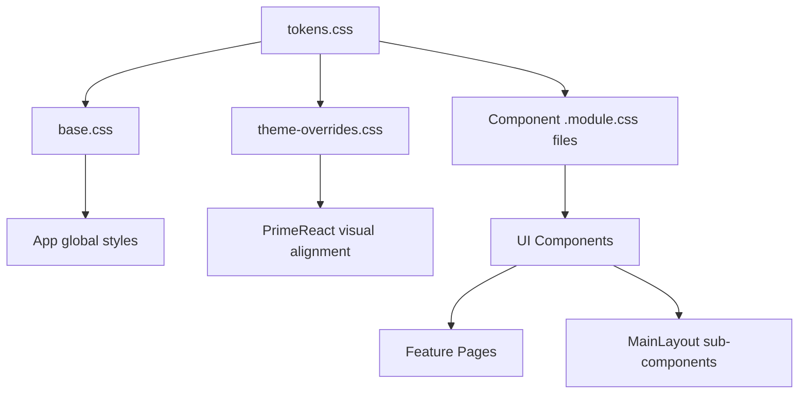

# Design Document: Emcure Design System

## Overview

The Emcure Design System is a CSS-variable-first, component-library implementation for the React frontend at `frontend/src/`. It establishes a single token layer, a library of reusable TypeScript/React components, and a refactored `MainLayout` — all derived from `Theme_Design_System_Prompt.md` as the authoritative source of truth.

The design system has three interleaved concerns:

1. **Token & style layer** — `tokens.css` + `base.css` in `src/assets/styles/` providing all CSS custom properties and global base styles.
2. **Component library** — reusable, typed React components under `src/shared/components/ui/`.
3. **Layout re-implementation** — `MainLayout.tsx` and its sub-components (Topbar, Sidebar, FlyoutSubmenu) rebuilt to match the design specification.

The system deliberately avoids new external UI frameworks. PrimeReact stays as the approved external library and is brought into visual alignment with the design system via an updated `theme-overrides.css`.

---

## Architecture

### Layered Style Architecture

The style system follows a strict cascade order. Each layer overrides only what it owns.

```
index.html
  └── Google Fonts (Poppins, JetBrains Mono) — <link> in <head>

src/main.tsx (import order is load order)
  1. primereact/resources/themes/lara-light-blue/theme.css   ← PrimeReact base
  2. primereact/resources/primereact.min.css                  ← PrimeReact components
  3. primeicons/primeicons.css                                ← icons
  4. primeflex/primeflex.css                                  ← PrimeFlex utilities
  5. src/assets/styles/tokens.css                             ← Emcure design tokens (:root vars)
  6. src/assets/styles/base.css                               ← global reset + typography
  7. src/assets/styles/theme-overrides.css                    ← PrimeReact overrides via token refs
```

`tokens.css` is imported before `base.css` and `theme-overrides.css` so every downstream rule can reference the CSS variables it declares.

### Component Architecture

Components live under `src/shared/components/ui/` and are exported from a barrel file. They have no knowledge of business domain — they are pure presentation units.

```
src/
├── assets/
│   └── styles/
│       ├── tokens.css            ← :root CSS variable definitions
│       ├── base.css              ← global reset, typography, scrollbars, utility classes
│       └── theme-overrides.css   ← PrimeReact selector overrides (updated to use tokens)
├── shared/
│   └── components/
│       └── ui/
│           ├── index.ts          ← barrel export
│           ├── Button/
│           │   ├── Button.tsx
│           │   └── Button.module.css
│           ├── FormControl/
│           │   ├── FormControl.tsx
│           │   ├── FormLabel.tsx
│           │   ├── CustomDropdown.tsx
│           │   └── FormControl.module.css
│           ├── Card/
│           │   ├── Card.tsx
│           │   └── Card.module.css
│           ├── PageHeader/
│           │   ├── PageHeader.tsx
│           │   └── PageHeader.module.css
│           ├── StatusBadge/
│           │   ├── StatusBadge.tsx
│           │   └── StatusBadge.module.css
│           ├── Alert/
│           │   ├── Alert.tsx
│           │   └── Alert.module.css
│           ├── KpiCard/
│           │   ├── KpiCard.tsx
│           │   ├── KpiGrid.tsx
│           │   └── KpiCard.module.css
│           ├── DataGrid/
│           │   ├── DataGrid.tsx
│           │   └── DataGrid.module.css
│           └── SectionTitle/
│               ├── SectionTitle.tsx
│               └── SectionTitle.module.css
└── app/
    └── layouts/
        ├── MainLayout.tsx         ← refactored layout
        ├── Topbar.tsx             ← extracted sub-component
        ├── Sidebar.tsx            ← extracted sub-component
        ├── FlyoutSubmenu.tsx      ← extracted flyout
        └── MainLayout.module.css
```

### Dependency Graph



---

## Components and Interfaces

### Token Layer (`tokens.css`)

No TypeScript interface — pure CSS. Declares the complete `:root` token set. All other files consume tokens from this file only; no token values are duplicated.

**Token categories:**
- Brand/Primary colors: `--color-primary`, `--color-primary-hover`, `--color-primary-active`, `--color-primary-50`, `--color-primary-100`, `--color-primary-200`
- Neutral scale: `--color-neutral-0` through `--color-neutral-900` (10 stops)
- Semantic: `--color-success`, `--color-warning`, `--color-error`, `--color-info`
- Typography: `--font-sans`, `--font-mono`
- Spacing: `--space-1` (4px) through `--space-12` (48px), non-continuous at 7/9/11
- Radius: `--radius-sm` (4px) through `--radius-full` (9999px)
- Shadows: `--shadow-sm`, `--shadow-md`, `--shadow-lg`, `--shadow-primary-sm`, `--shadow-primary-md`, `--shadow-dropdown`
- Layout: `--topbar-height` (55px), `--sidenav-width` (220px)
- Motion: `--duration-fast` (150ms), `--duration-normal` (250ms), `--duration-slow` (400ms), `--ease-out`, `--ease-spring`

### Button Component

```typescript
type ButtonVariant = 'primary' | 'secondary' | 'ghost' | 'danger' | 'save' | 'delete' | 'sm';

interface ButtonProps {
  /** Visual style variant */
  variant?: ButtonVariant;
  /** Button content */
  children: React.ReactNode;
  /** Click handler */
  onClick?: (e: React.MouseEvent<HTMLButtonElement>) => void;
  /** Disables the button — prevents clicks and applies visual treatment */
  disabled?: boolean;
  /** HTML button type */
  type?: 'button' | 'submit' | 'reset';
  /** Additional class names */
  className?: string;
  /** ARIA label for icon-only buttons */
  'aria-label'?: string;
}
```

Design notes:
- All variants share pill shape via `--radius-full`, `font-size: 13px`, `font-weight: 600`.
- `sm` is a size modifier, not a color variant — it can be combined with other variants by composing class names.
- Hover shine effect uses a `::before` pseudo-element with `overflow: hidden` on the button root. The element slides `translateX(-100%)` → `translateX(100%)` on hover.
- Active press state uses `transform: translateY(1px) scale(0.98)`.

### FormControl Component

```typescript
interface FormControlProps extends React.InputHTMLAttributes<HTMLInputElement | HTMLTextAreaElement | HTMLSelectElement> {
  /** Renders as different HTML element */
  as?: 'input' | 'textarea' | 'select';
  /** Additional class names */
  className?: string;
}

interface FormLabelProps {
  /** Associated input id */
  htmlFor?: string;
  children: React.ReactNode;
  className?: string;
}
```

### CustomDropdown Component

```typescript
interface DropdownOption {
  value: string | number;
  label: string;
}

interface CustomDropdownProps {
  /** Available options */
  options: DropdownOption[];
  /** Currently selected value */
  value: string | number | null;
  /** Change handler */
  onChange: (value: string | number) => void;
  /** Placeholder when no value selected */
  placeholder?: string;
  /** Disables the dropdown */
  disabled?: boolean;
  className?: string;
}
```

Design notes:
- Dropdown panel uses `position: absolute` relative to the trigger. The trigger receives `border-radius: var(--radius-md) var(--radius-md) 0 0` when open, connecting visually to the panel.
- Panel animates with `dropIn` keyframe: `opacity 0→1` + `translateY(-4px)→translateY(0)` over `var(--duration-normal)`.
- Panel is rendered in a portal to avoid `overflow: hidden` clipping from ancestor containers.

### Card Component

```typescript
interface CardProps {
  /** Optional header text */
  header?: string;
  /** Card body content */
  children: React.ReactNode;
  className?: string;
}

interface CardHeaderProps {
  children: React.ReactNode;
  className?: string;
}

interface CardBodyProps {
  children: React.ReactNode;
  className?: string;
}
```

### PageHeader Component

```typescript
interface PageHeaderProps {
  /** Main page title — rendered at 20px/700 */
  title: string;
  /** Optional subtitle — rendered at 13px/neutral-600 */
  subtitle?: string;
  /** Optional right-side action slot */
  actions?: React.ReactNode;
  className?: string;
}
```

### StatusBadge Component

```typescript
type StatusBadgeVariant =
  | 'success' | 'warning' | 'error' | 'info' | 'draft'
  | 'completed' | 'overdue' | 'waiting' | 'assigned' | 'referred';

interface StatusBadgeProps {
  /** Visual/semantic variant */
  variant: StatusBadgeVariant;
  /** Label text to display */
  label: string;
  className?: string;
}
```

Design notes:
- All variants use `border-radius: var(--radius-full)`, `font-size: 11px`, `font-weight: 600`, `text-transform: uppercase`, `letter-spacing: 0.04em`, and a `::before` dot.
- Gradient variants (`completed`, `overdue`, `waiting`, `assigned`, `referred`) use CSS `linear-gradient` backgrounds. `waiting` and `assigned` use dark text; the rest use white.

### Alert Component

```typescript
type AlertVariant = 'success' | 'warning' | 'error' | 'info';

interface AlertProps {
  /** Alert type controlling color scheme */
  variant: AlertVariant;
  /** Optional bold title */
  title?: string;
  /** Main alert message */
  message?: string;
  /** Optional icon element or className */
  icon?: React.ReactNode;
  className?: string;
}
```

### KpiCard Component

```typescript
type KpiIconColor = 'red' | 'green' | 'orange' | 'blue' | 'violet' | 'slate';

interface KpiCardProps {
  /** Icon element to render in the icon box */
  icon: React.ReactNode;
  /** Color variant for the icon background box */
  iconColor?: KpiIconColor;
  /** Primary numeric/text value */
  value: string | number;
  /** Label beneath the value */
  label: string;
  /** Optional trend value — positive = green chip, negative = red chip */
  delta?: number;
  className?: string;
}

interface KpiGridProps {
  children: React.ReactNode;
  className?: string;
}
```

Design notes:
- `delta` of `0` is treated as neutral and renders with a grey chip.
- The icon box is fixed `46×46px` with `border-radius: var(--radius-md)`.
- Hover lift transition uses `var(--duration-normal)` + `var(--ease-spring)`.

### DataGrid Component

```typescript
interface DataGridColumn<T = Record<string, unknown>> {
  /** Column header text */
  header: string;
  /** Key of the row data object to render */
  field: keyof T;
  /** Optional custom cell renderer */
  render?: (value: T[keyof T], row: T) => React.ReactNode;
  /** Fixed column width */
  width?: string;
}

interface DataGridProps<T = Record<string, unknown>> {
  /** Column definitions */
  columns: DataGridColumn<T>[];
  /** Row data */
  data: T[];
  /** Loading state — shows skeleton rows */
  loading?: boolean;
  /** Total record count for pagination display */
  totalRecords?: number;
  /** Current page (1-indexed) */
  page?: number;
  /** Rows per page */
  pageSize?: number;
  /** Page change handler */
  onPageChange?: (page: number) => void;
  /** Search string change handler */
  onSearch?: (query: string) => void;
  /** Optional toolbar action slot */
  toolbarActions?: React.ReactNode;
  className?: string;
}
```

### SectionTitle Component

```typescript
interface SectionTitleProps {
  /** Label text to display */
  children: React.ReactNode;
  className?: string;
}
```

### MainLayout Sub-components

**Topbar:**
```typescript
interface TopbarProps {
  /** Current page title for display */
  pageTitle?: string;
}
```

**Sidebar:**
```typescript
interface NavItem {
  label: string;
  icon: string;
  path: string;
  section?: string;
  menuKey?: string;
  children?: NavItem[];
}

interface SidebarProps {
  navItems: NavItem[];
}
```

**FlyoutSubmenu:**
```typescript
interface FlyoutSubmenuProps {
  /** Items to render in the flyout */
  items: NavItem[];
  /** Anchor element's DOMRect for positioning */
  anchorRect: DOMRect;
  /** Visibility control */
  visible: boolean;
  /** Called when flyout should hide (with hide delay applied) */
  onHide: () => void;
}
```

---

## Data Models

There are no server-side data models introduced by this feature — the design system is purely presentational. The relevant data shapes are the TypeScript prop interfaces defined in the Components section above.

### CSS Token Model

The token layer encodes the following value model:

| Token Group | Count | Pattern |
|---|---|---|
| Brand (primary) | 6 | `--color-primary[-suffix]` |
| Neutral scale | 10 | `--color-neutral-{0,50,100,200,300,400,500,600,800,900}` |
| Semantic | 4 | `--color-{success,warning,error,info}` |
| Typography | 2 | `--font-{sans,mono}` |
| Spacing | 9 | `--space-{1-12}` (4px steps, skipping 7, 9, 11) |
| Radius | 5 | `--radius-{sm,md,lg,xl,full}` |
| Shadows | 6 | `--shadow-{sm,md,lg,primary-sm,primary-md,dropdown}` |
| Layout | 2 | `--topbar-height`, `--sidenav-width` |
| Motion duration | 3 | `--duration-{fast,normal,slow}` |
| Motion easing | 2 | `--ease-{out,spring}` |

### Component Variant Model

Status badge variants map to two categories:

```
Flat variants (background + text color):
  success | warning | error | info | draft

Gradient variants (CSS gradient background):
  completed | overdue | waiting | assigned | referred
```

Button variants are independent of size modifier:

```
Color variants:  primary | secondary | ghost | danger | save | delete
Size modifier:   sm
```

---

## Correctness Properties

*A property is a characteristic or behavior that should hold true across all valid executions of a system — essentially, a formal statement about what the system should do. Properties serve as the bridge between human-readable specifications and machine-verifiable correctness guarantees.*

The Emcure Design System is primarily composed of CSS configuration and UI rendering. Most acceptance criteria are static CSS value assertions (best verified as example tests) or visual requirements (not machine-verifiable). Three properties emerge from the interaction logic of components where input variation meaningfully changes behavior:

### Property 1: Disabled Button Blocks All Click Events

*For any* Button `variant` and *any* `onClick` handler, when the `disabled` prop is `true`, clicking the button must not invoke the `onClick` handler — regardless of which variant is rendered.

**Validates: Requirements 4.11**

---

### Property 2: KpiCard Delta Chip Color Tracks Sign

*For any* non-zero numeric `delta` value passed to a `KpiCard`, the rendered delta chip must apply a green-tinted style when `delta > 0` and a red-tinted style when `delta < 0`. The sign of the delta uniquely determines the chip color class.

**Validates: Requirements 10.6**

---

### Property 3: DataGrid Even-Row Striping Invariant

*For any* non-empty array of row data passed to a `DataGrid`, every row at an even index (0, 2, 4, …) must carry the striped-row background style, and every row at an odd index must not carry that style — regardless of the data content or row count.

**Validates: Requirements 11.5**

---

## Error Handling

### Token Resolution Fallbacks

CSS custom properties that are undefined resolve to their initial value (empty/inherited). To prevent invisible failures:
- `tokens.css` must be imported before any component stylesheet.
- Components must not reference tokens that do not exist in `tokens.css`. If a new token is needed, it is added to `tokens.css` first.

### Component Prop Validation

- All component props use TypeScript strict mode (`tsconfig.json` already has `"strict": true`).
- The `any` type is prohibited in all UI component files.
- Optional props with meaningful defaults (e.g., `variant?: ButtonVariant` defaults to `'primary'`) are always given an explicit `defaultProps`-style default in the destructuring signature.

### Flyout Submenu Positioning

`getBoundingClientRect()` returns all zeros for elements not yet rendered. The `FlyoutSubmenu` must:
1. Only compute position when `visible` transitions from `false` to `true`.
2. Guard against a null `anchorRect` by not rendering the flyout if the rect has zero dimensions.
3. Clamp the flyout position to remain within the viewport if the sidebar is near the bottom edge.

### PrimeReact Override Conflicts

`theme-overrides.css` is positioned after PrimeReact CSS in the import chain, so specificity is managed by selector order rather than `!important`. However, some PrimeReact rules use compound selectors with high specificity. The migration strategy:
- Add token references to existing selectors rather than replacing them with new rules.
- Avoid `!important` except where the existing PrimeReact rule already uses it.

### Legacy Page Compatibility

Existing pages (`UserListPage`, `LoginPage`, `RolesPage`, `AuditLogsPage`) use `em-card`, `em-topbar`, and `em-sidebar` CSS classes from the existing `theme-overrides.css`. These class definitions must be retained (updated to reference tokens) during migration. Pages should be migrated to use the new component library incrementally, not all at once.

---

## Testing Strategy

This feature is primarily CSS configuration, UI rendering, and component composition — areas where property-based testing applies only narrowly. The testing strategy uses a tiered approach.

### Tier 1: Smoke Tests (CSS file structure)

Verify the existence and correct value of the CSS token definitions. These run fast and catch regressions immediately.

Examples:
- `tokens.css` declares `--color-primary: #ed1c24`
- `tokens.css` declares `--topbar-height: 55px`
- `base.css` contains the `*` box-sizing reset
- `index.html` contains the Google Fonts `<link>` tag
- `src/shared/components/ui/index.ts` barrel file exists and exports the expected component names

### Tier 2: Unit / Example Tests (component rendering)

Use **Vitest** + **@testing-library/react** to render each component and assert:

- `Button` — each variant applies its expected CSS module class; disabled state applies correct classes.
- `FormControl` — correct class applied; focus/hover classes toggle on simulated events.
- `CustomDropdown` — opens on click; option hover/selected styles toggle; panel animates in.
- `Card` — header renders when `header` prop is provided; body renders children.
- `PageHeader` — title renders; subtitle is absent when not provided; actions slot renders.
- `StatusBadge` — each of the 12 variants renders with the expected CSS class.
- `Alert` — each of 4 variants renders with correct class; title/message render conditionally.
- `KpiCard` — icon box renders with correct color class; delta chip is absent when `delta` is undefined.
- `DataGrid` — toolbar renders; headers are present; pagination footer renders when `totalRecords` provided.
- `SectionTitle` — children render; decorative line pseudo-element is present in styles.
- `MainLayout` — topbar renders at correct z-index; sidebar renders; main content area has correct margin.

### Tier 3: Property-Based Tests

Use **Vitest** + **fast-check** for the three identified properties. Each runs a minimum of 100 iterations.

**Test file location:** `frontend/tests/unit/ui-properties.test.tsx`

#### Property 1 — Disabled Button Blocks All Click Events

```typescript
// Feature: emcure-design-system, Property 1: Disabled button blocks all click events
fc.assert(
  fc.property(
    fc.constantFrom('primary', 'secondary', 'ghost', 'danger', 'save', 'delete'),
    (variant) => {
      const onClick = vi.fn();
      const { getByRole } = render(
        <Button variant={variant as ButtonVariant} disabled onClick={onClick}>
          Click me
        </Button>
      );
      fireEvent.click(getByRole('button'));
      expect(onClick).not.toHaveBeenCalled();
    }
  ),
  { numRuns: 100 }
);
```

#### Property 2 — KpiCard Delta Chip Color Tracks Sign

```typescript
// Feature: emcure-design-system, Property 2: KpiCard delta chip color tracks sign
fc.assert(
  fc.property(
    fc.integer({ min: 1, max: 100_000 }),    // positive delta
    fc.integer({ min: -100_000, max: -1 }),  // negative delta
    (posDelta, negDelta) => {
      // Positive delta → green chip class
      const { container: posContainer } = render(
        <KpiCard icon={<span />} value={42} label="Test" delta={posDelta} />
      );
      expect(posContainer.querySelector('.deltaPositive')).toBeTruthy();
      expect(posContainer.querySelector('.deltaNegative')).toBeNull();

      // Negative delta → red chip class
      const { container: negContainer } = render(
        <KpiCard icon={<span />} value={42} label="Test" delta={negDelta} />
      );
      expect(negContainer.querySelector('.deltaNegative')).toBeTruthy();
      expect(negContainer.querySelector('.deltaPositive')).toBeNull();
    }
  ),
  { numRuns: 100 }
);
```

#### Property 3 — DataGrid Even-Row Striping Invariant

```typescript
// Feature: emcure-design-system, Property 3: DataGrid even-row striping invariant
fc.assert(
  fc.property(
    fc.array(fc.record({ id: fc.nat(), name: fc.string() }), { minLength: 1, maxLength: 50 }),
    (rows) => {
      const columns = [
        { header: 'ID', field: 'id' as const },
        { header: 'Name', field: 'name' as const },
      ];
      const { container } = render(<DataGrid columns={columns} data={rows} />);
      const tableRows = container.querySelectorAll('tbody tr');

      tableRows.forEach((row, index) => {
        if (index % 2 === 0) {
          expect(row.classList.contains('rowEven')).toBe(true);
        } else {
          expect(row.classList.contains('rowEven')).toBe(false);
        }
      });
    }
  ),
  { numRuns: 100 }
);
```

### Property Test Configuration

- Library: **fast-check** (`npm install --save-dev fast-check`)
- Runner: **Vitest** (already in project)
- Minimum runs per property: **100**
- Each test references its design property via the comment tag above the `fc.assert` call.

### Dual Testing Approach

Unit tests cover specific examples and edge cases. Property tests verify universal invariants. Together:

| Concern | Unit tests | Property tests |
|---|---|---|
| CSS token values | ✅ exact value assertions | — |
| Component renders with each variant | ✅ per-variant snapshot | — |
| Disabled button behavior | ✅ single example | ✅ Property 1 (all variants) |
| KpiCard delta rendering | ✅ positive and negative examples | ✅ Property 2 (full integer range) |
| DataGrid row striping | ✅ 3-row example | ✅ Property 3 (1–50 rows) |
| Flyout positioning logic | ✅ example with mocked DOMRect | — |
| Animation class application | ✅ after-event assertion | — |
