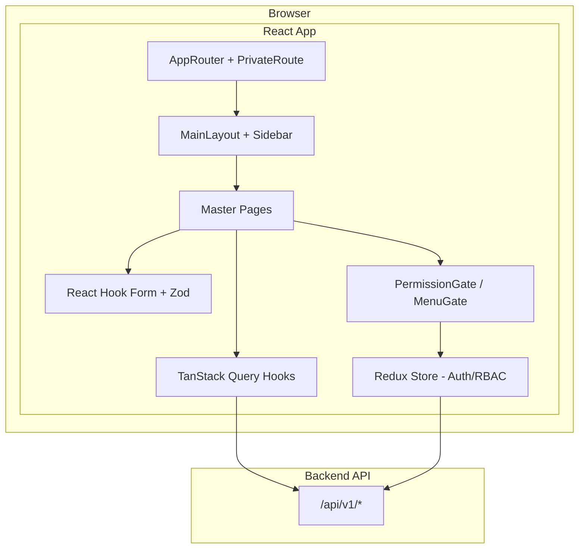
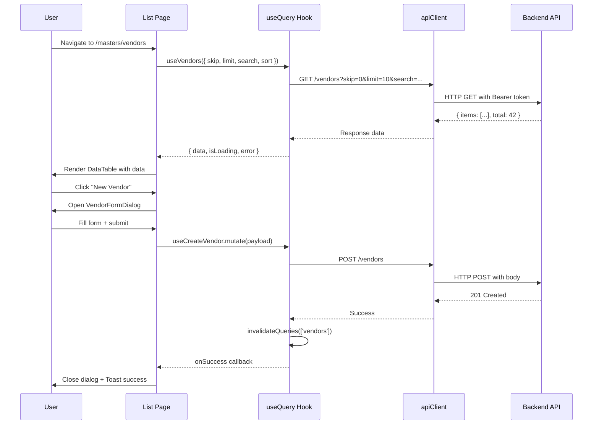

# Design Document: LACM Masters Frontend

## Overview

This design document describes the frontend module for managing LACM Master entities (Entity, Vendor, Customer, Product Master, Product Detail, Agreement, Vendor–Customer Mapping, Invoice). The module is a React 19 feature module that consumes existing backend REST APIs, following the established architecture patterns: TanStack React Query for server state, Redux Toolkit for auth/RBAC, React Hook Form + Zod for form validation, and PrimeReact for UI primitives.

The module is organised under `src/features/masters/` with the standard feature-based subdirectory structure (api/, components/, hooks/, models/, pages/, routes/, store/). Each master entity has its own list page, create/edit dialog, and dedicated TanStack Query hooks. A shared `BulkUploadDialog` component is reused across all entities.

### Key Design Decisions

1. **PrimeReact DataTable over custom DataGrid** — The existing `DataGrid` component lacks built-in column sorting and column-level filtering. PrimeReact's `DataTable` with `Column` components provides server-side pagination, sorting, and per-column filter inputs out of the box.
2. **Server-side pagination and filtering** — All list endpoints support `skip`, `limit`, `search`, `sort_by`, `sort_order` parameters. The frontend delegates pagination/sorting/filtering to the server rather than loading all records.
3. **Single feature module** — All 8 master entities live under one `masters` feature because they share routing structure, RBAC patterns, the bulk upload dialog, and cross-entity dropdown dependencies.
4. **Vendor Agent role filtering** — Agreement and Mapping pages detect the current user's vendor association from Redux auth state and automatically apply `vendor_id` filters to API calls.
5. **Zod schemas as single source of truth** — Each entity has one Zod schema used for both create and edit forms (with `.partial()` or refinements for edit mode differences).

---

## Architecture

### High-Level Architecture



### Feature Module Structure

```
src/features/masters/
├── api/
│   ├── entityApi.ts
│   ├── vendorApi.ts
│   ├── customerApi.ts
│   ├── productMasterApi.ts
│   ├── productDetailApi.ts
│   ├── agreementApi.ts
│   ├── mappingApi.ts
│   ├── invoiceApi.ts
│   └── bulkUploadApi.ts
├── components/
│   ├── BulkUploadDialog.tsx
│   ├── EntityFormDialog.tsx
│   ├── VendorFormDialog.tsx
│   ├── VendorDeactivateDialog.tsx
│   ├── CustomerFormDialog.tsx
│   ├── ProductMasterFormDialog.tsx
│   ├── ProductDetailFormDialog.tsx
│   ├── AgreementFormDialog.tsx
│   ├── AgreementRenewalDialog.tsx
│   ├── MappingFormDialog.tsx
│   ├── InvoiceForm.tsx
│   ├── InvoiceLineItems.tsx
│   ├── PaymentUpdateDialog.tsx
│   ├── SettleConfirmDialog.tsx
│   ├── EligibilityPanel.tsx
│   └── CommissionSlabInfo.tsx
├── hooks/
│   ├── useEntities.ts
│   ├── useVendors.ts
│   ├── useCustomers.ts
│   ├── useProductMasters.ts
│   ├── useProductDetails.ts
│   ├── useAgreements.ts
│   ├── useMappings.ts
│   └── useInvoices.ts
├── models/
│   ├── entity.ts
│   ├── vendor.ts
│   ├── customer.ts
│   ├── productMaster.ts
│   ├── productDetail.ts
│   ├── agreement.ts
│   ├── mapping.ts
│   ├── invoice.ts
│   └── common.ts
├── pages/
│   ├── EntityListPage.tsx
│   ├── VendorListPage.tsx
│   ├── CustomerListPage.tsx
│   ├── ProductMasterListPage.tsx
│   ├── ProductDetailListPage.tsx
│   ├── AgreementListPage.tsx
│   ├── MappingListPage.tsx
│   └── InvoiceListPage.tsx
├── routes/
│   └── mastersRoutes.tsx
├── schemas/
│   ├── entitySchema.ts
│   ├── vendorSchema.ts
│   ├── customerSchema.ts
│   ├── productMasterSchema.ts
│   ├── productDetailSchema.ts
│   ├── agreementSchema.ts
│   ├── mappingSchema.ts
│   └── invoiceSchema.ts
└── index.ts
```

### Data Flow



---

## Components and Interfaces

### API Layer

Each entity API module follows the same pattern as the existing `userApi.ts`:

```typescript
// api/vendorApi.ts
import { apiClient } from '@shared/services/apiClient';
import type { Vendor, VendorListResponse, CreateVendorRequest, UpdateVendorRequest } from '../models/vendor';
import type { PaginatedParams } from '../models/common';

export const vendorApi = {
  list: async (params: PaginatedParams): Promise<VendorListResponse> => {
    const { data } = await apiClient.get<VendorListResponse>('/vendors', { params });
    return data;
  },
  getById: async (id: string): Promise<Vendor> => {
    const { data } = await apiClient.get<Vendor>(`/vendors/${id}`);
    return data;
  },
  create: async (request: CreateVendorRequest): Promise<Vendor> => {
    const { data } = await apiClient.post<Vendor>('/vendors', request);
    return data;
  },
  update: async (id: string, request: UpdateVendorRequest): Promise<Vendor> => {
    const { data } = await apiClient.put<Vendor>(`/vendors/${id}`, request);
    return data;
  },
  deactivate: async (id: string): Promise<void> => {
    await apiClient.delete(`/vendors/${id}/deactivate`);
  },
};
```

### TanStack Query Hooks

Each hook module follows the established pattern with 30s staleTime and `invalidateQueries` on mutation success:

```typescript
// hooks/useVendors.ts
import { useQuery, useMutation, useQueryClient } from '@tanstack/react-query';
import { vendorApi } from '../api/vendorApi';
import type { PaginatedParams } from '../models/common';

const VENDORS_KEY = ['vendors'];

export const useVendors = (params: PaginatedParams) => {
  return useQuery({
    queryKey: [...VENDORS_KEY, params],
    queryFn: () => vendorApi.list(params),
    staleTime: 30_000,
  });
};

export const useCreateVendor = () => {
  const queryClient = useQueryClient();
  return useMutation({
    mutationFn: vendorApi.create,
    onSuccess: () => queryClient.invalidateQueries({ queryKey: VENDORS_KEY }),
  });
};

export const useUpdateVendor = () => {
  const queryClient = useQueryClient();
  return useMutation({
    mutationFn: ({ id, request }) => vendorApi.update(id, request),
    onSuccess: () => queryClient.invalidateQueries({ queryKey: VENDORS_KEY }),
  });
};

export const useDeactivateVendor = () => {
  const queryClient = useQueryClient();
  return useMutation({
    mutationFn: vendorApi.deactivate,
    onSuccess: () => queryClient.invalidateQueries({ queryKey: VENDORS_KEY }),
  });
};
```

### Zod Validation Schemas

```typescript
// schemas/vendorSchema.ts
import { z } from 'zod';

export const vendorCreateSchema = z.object({
  vendor_code: z.string().min(1, 'This field is required').max(50),
  vendor_name: z.string().min(1, 'This field is required').max(200),
  vendor_email: z.string().min(1, 'This field is required').email('Must be a valid email').max(254),
  vendor_contact: z.string().max(20).optional().or(z.literal('')),
  vendor_address: z.string().optional().or(z.literal('')),
  gstn_number: z.string().regex(/^[A-Z0-9]{15}$/, 'Must be 15 alphanumeric characters').optional().or(z.literal('')),
  pan_number: z.string().max(10).optional().or(z.literal('')),
  bank_account_no: z.string().max(30).optional().or(z.literal('')),
  bank_ifsc: z.string().max(11).optional().or(z.literal('')),
  bank_name: z.string().max(100).optional().or(z.literal('')),
});

export type VendorCreateFormData = z.infer<typeof vendorCreateSchema>;
```

### Page Components (Low-Level Design)

Each list page follows this structure:

1. **State management**: pagination params (page, pageSize), sort state, search/filter state, dialog visibility booleans
2. **Data fetching**: TanStack Query hook with reactive params
3. **DataTable rendering**: PrimeReact `DataTable` with server-side pagination, sortable columns, and column filter inputs
4. **Action handlers**: open create/edit dialogs, handle mutations with Toast notifications
5. **RBAC gating**: `PermissionGate` wrapping action buttons, `PrivateRoute` on route

### Shared Components

#### BulkUploadDialog

```typescript
interface BulkUploadDialogProps {
  visible: boolean;
  onHide: () => void;
  entityType: 'vendor' | 'customer' | 'product_master' | 'product_detail' | 'agreement' | 'mapping';
  onSuccess: () => void;
}
```

Handles: file selection (CSV/XLSX), upload to `/bulk-upload` with `entity_type` param, displays summary and row-level errors, provides template download links.

#### EligibilityPanel

```typescript
interface EligibilityPanelProps {
  invoiceId: string;
  visible: boolean;
  onHide: () => void;
}
```

Displays the 3-check claim validation triangle with pass/fail indicators.

#### CommissionSlabInfo

Read-only panel showing the commission calculation formula within agreement dialogs.

### Routing Integration

```typescript
// routes/mastersRoutes.tsx
export const mastersRoutes = [
  { path: 'entities',        element: <EntityListPage />,        menuKey: 'entities' },
  { path: 'vendors',         element: <VendorListPage />,        menuKey: 'vendors' },
  { path: 'customers',       element: <CustomerListPage />,      menuKey: 'customers' },
  { path: 'products',        element: <ProductMasterListPage />, menuKey: 'products' },
  { path: 'product-details', element: <ProductDetailListPage />, menuKey: 'product_details' },
  { path: 'agreements',      element: <AgreementListPage />,     menuKey: 'agreements' },
  { path: 'mappings',        element: <MappingListPage />,       menuKey: 'mappings' },
  { path: 'invoices',        element: <InvoiceListPage />,       menuKey: 'invoices' },
];
```

These routes are registered in `AppRouter.tsx` under a `/masters` parent route, each wrapped with `PrivateRoute` + the corresponding `menuKey`.

### Sidebar Navigation Update

A new "Masters" section is added to `APP_NAV_ITEMS` in `MainLayout.tsx` with children for each entity, each gated by `menuKey`:

```typescript
{
  label: 'Masters',
  icon: 'pi pi-database',
  section: 'Masters',
  children: [
    { label: 'Entities',        path: '/masters/entities',        menuKey: 'entities' },
    { label: 'Vendors',         path: '/masters/vendors',         menuKey: 'vendors' },
    { label: 'Customers',       path: '/masters/customers',       menuKey: 'customers' },
    { label: 'Products',        path: '/masters/products',        menuKey: 'products' },
    { label: 'Product Details', path: '/masters/product-details', menuKey: 'product_details' },
    { label: 'Agreements',      path: '/masters/agreements',      menuKey: 'agreements' },
    { label: 'Mappings',        path: '/masters/mappings',        menuKey: 'mappings' },
    { label: 'Invoices',        path: '/masters/invoices',        menuKey: 'invoices' },
  ],
}
```

---

## Data Models

### Common Types

```typescript
// models/common.ts
export interface PaginatedParams {
  skip: number;
  limit: number;
  search?: string;
  sort_by?: string;
  sort_order?: 'asc' | 'desc';
  status?: string;
  [key: string]: unknown; // additional filters
}

export interface PaginatedResponse<T> {
  items: T[];
  total: number;
  skip: number;
  limit: number;
}

export interface DropdownOption {
  label: string;
  value: string;
}

export interface BulkUploadResponse {
  total: number;
  successful: number;
  failed: number;
  errors: Array<{ row: number; message: string }>;
}
```

### Entity Master

```typescript
// models/entity.ts
export interface Entity {
  id: string;
  entity_name: string;
  short_code: string | null;
  company_code: string | null;
  is_active: boolean;
  created_at: string;
  updated_at: string;
  created_by: string | null;
  updated_by: string | null;
}

export interface EntityListResponse extends PaginatedResponse<Entity> {}

export interface CreateEntityRequest {
  entity_name: string;
  short_code?: string;
  company_code?: string;
}

export interface UpdateEntityRequest {
  entity_name?: string;
  short_code?: string;
  company_code?: string;
  is_active?: boolean;
}

export interface EntityDropdownItem {
  id: string;
  label: string; // "{Short Code} - {Entity Name}"
}
```

### Vendor Master

```typescript
// models/vendor.ts
export type VendorStatus = 'Active' | 'Inactive';

export interface Vendor {
  id: string;
  vendor_code: string;
  vendor_name: string;
  vendor_email: string;
  vendor_contact: string | null;
  vendor_address: string | null;
  gstn_number: string | null;
  pan_number: string | null;
  bank_account_no: string | null;
  bank_ifsc: string | null;
  bank_name: string | null;
  portal_user_id: string | null;
  status: VendorStatus;
  created_at: string;
  modified_at: string;
  created_by: string | null;
  modified_by: string | null;
}

export interface VendorListResponse extends PaginatedResponse<Vendor> {}

export interface CreateVendorRequest {
  vendor_code: string;
  vendor_name: string;
  vendor_email: string;
  vendor_contact?: string;
  vendor_address?: string;
  gstn_number?: string;
  pan_number?: string;
  bank_account_no?: string;
  bank_ifsc?: string;
  bank_name?: string;
}

export interface UpdateVendorRequest extends Partial<CreateVendorRequest> {}
```

### Customer Master

```typescript
// models/customer.ts
export type CustomerType = 'Government Medical Corporation' | 'Hospital' | 'Pharmacy' | 'Institution' | 'Other';
export type CustomerStatus = 'Active' | 'Inactive';

export interface Customer {
  id: string;
  customer_code: string;
  customer_name: string;
  customer_type: CustomerType | null;
  address: string | null;
  gstn_number: string | null;
  contact_person: string | null;
  contact_number: string | null;
  contact_email: string | null;
  status: CustomerStatus;
  created_at: string;
  modified_at: string;
  created_by: string | null;
  modified_by: string | null;
}

export interface CustomerListResponse extends PaginatedResponse<Customer> {}

export interface CreateCustomerRequest {
  customer_code: string;
  customer_name: string;
  customer_type?: CustomerType;
  address?: string;
  gstn_number?: string;
  contact_person?: string;
  contact_number?: string;
  contact_email?: string;
}

export interface UpdateCustomerRequest extends Partial<CreateCustomerRequest> {
  status?: CustomerStatus;
}
```

### Product Master

```typescript
// models/productMaster.ts
export type ProductStatus = 'Active' | 'Inactive';

export interface ProductMaster {
  id: string;
  basic_material_code: string;
  product_name: string;
  therapeutic_category: string | null;
  status: ProductStatus;
  created_at: string;
  modified_at: string;
  created_by: string | null;
  modified_by: string | null;
}

export interface ProductMasterListResponse extends PaginatedResponse<ProductMaster> {}

export interface CreateProductMasterRequest {
  basic_material_code: string;
  product_name: string;
  therapeutic_category?: string;
}

export interface UpdateProductMasterRequest extends Partial<CreateProductMasterRequest> {
  status?: ProductStatus;
}
```

### Product Detail

```typescript
// models/productDetail.ts
export interface ProductDetail {
  id: string;
  child_code: string;
  product_master_id: string;
  product_master_name: string; // denormalized from parent
  variant_description: string | null;
  hsn_code: string | null;
  pack_size: string | null;
  unit_of_measure: string | null;
  mrp: number | null;
  rate: number | null;
  gst_percent: number | null;
  status: ProductStatus;
  created_at: string;
  modified_at: string;
  created_by: string | null;
  modified_by: string | null;
}

export interface ProductDetailListResponse extends PaginatedResponse<ProductDetail> {}

export interface CreateProductDetailRequest {
  child_code: string;
  product_master_id: string;
  variant_description?: string;
  hsn_code?: string;
  pack_size?: string;
  unit_of_measure?: string;
  mrp?: number;
  rate?: number;
  gst_percent?: number;
}

export interface UpdateProductDetailRequest extends Partial<Omit<CreateProductDetailRequest, 'child_code'>> {
  status?: ProductStatus;
}
```

### Agreement Master

```typescript
// models/agreement.ts
export type AgreementType = 'Original' | 'Renewal';
export type AgreementStatus = 'Active' | 'Expired' | 'Renewed';

export interface Agreement {
  id: string;
  vendor_id: string;
  vendor_name: string;
  product_detail_id: string;
  product_detail_child_code: string;
  product_detail_name: string;
  from_date: string; // ISO date
  to_date: string;
  slab_in_days: number;
  reduction_percent: number;
  max_commission_percent: number;
  min_commission_percent: number;
  credit_days: number;
  agreement_type: AgreementType;
  prior_agreement_id: string | null;
  agreement_document_url: string | null;
  status: AgreementStatus;
  created_at: string;
  modified_at: string;
  created_by: string | null;
  modified_by: string | null;
}

export interface AgreementListResponse extends PaginatedResponse<Agreement> {}

export interface CreateAgreementRequest {
  vendor_id: string;
  product_detail_id: string;
  from_date: string;
  to_date: string;
  slab_in_days: number;
  reduction_percent: number;
  max_commission_percent: number;
  min_commission_percent: number;
  credit_days: number;
  agreement_document?: File;
}

export interface UpdateAgreementRequest extends Partial<CreateAgreementRequest> {}

export interface RenewAgreementRequest {
  from_date: string;
  to_date: string;
  slab_in_days: number;
  reduction_percent: number;
  max_commission_percent: number;
  min_commission_percent: number;
  credit_days: number;
  agreement_document?: File;
}
```

### Vendor–Customer Mapping

```typescript
// models/mapping.ts
export type MappingStatus = 'Active' | 'Expired';

export interface VendorCustomerMapping {
  id: string;
  vendor_id: string;
  vendor_name: string;
  customer_id: string;
  customer_name: string;
  validity_from: string; // ISO date
  validity_to: string;
  status: MappingStatus;
  created_at: string;
  modified_at: string;
  created_by: string | null;
  modified_by: string | null;
}

export interface MappingListResponse extends PaginatedResponse<VendorCustomerMapping> {}

export interface CreateMappingRequest {
  vendor_id: string;
  customer_id: string;
  validity_from: string;
  validity_to: string;
}

export interface UpdateMappingRequest {
  validity_from: string;
  validity_to: string;
}
```

### Invoice Master

```typescript
// models/invoice.ts
export type InvoiceStatus = 'Open' | 'Payment Cleared' | 'Settled';

export interface InvoiceLine {
  id: string;
  product_detail_id: string;
  product_detail_name: string;
  quantity: number | null;
  line_amount: number | null;
  vat_gst_amount: number | null;
}

export interface Invoice {
  id: string;
  invoice_number: string;
  invoice_date: string;
  vendor_id: string;
  vendor_name: string;
  customer_id: string;
  customer_name: string;
  bill_amount_excl_gst: number;
  bill_amount_incl_tax: number | null;
  amount_deducted: number;
  tds_value: number;
  due_date: string | null;
  payment_clearing_date: string | null;
  sap_clearing_doc_no: string | null;
  status: InvoiceStatus;
  lines: InvoiceLine[];
  created_at: string;
  modified_at: string;
  created_by: string | null;
  modified_by: string | null;
}

export interface InvoiceListResponse extends PaginatedResponse<Invoice> {}

export interface CreateInvoiceLineRequest {
  product_detail_id: string;
  quantity?: number;
  line_amount?: number;
  vat_gst_amount?: number;
}

export interface CreateInvoiceRequest {
  invoice_number: string;
  invoice_date: string;
  vendor_id: string;
  customer_id: string;
  bill_amount_excl_gst: number;
  bill_amount_incl_tax?: number;
  amount_deducted?: number;
  tds_value?: number;
  lines: CreateInvoiceLineRequest[];
}

export interface PaymentUpdateRequest {
  payment_clearing_date: string;
  sap_clearing_doc_no?: string;
}

export interface EligibilityCheck {
  agreement_valid: boolean;
  agreement_message: string;
  mapping_valid: boolean;
  mapping_message: string;
  status_valid: boolean;
  status_message: string;
  overall_eligible: boolean;
}
```

---


## Correctness Properties

*A property is a characteristic or behavior that should hold true across all valid executions of a system — essentially, a formal statement about what the system should do. Properties serve as the bridge between human-readable specifications and machine-verifiable correctness guarantees.*

### Property 1: Entity dropdown formatting

*For any* Entity object with any combination of `short_code` (including null, empty string, or valid string) and `entity_name`, the dropdown formatter SHALL produce a string matching the pattern `"{X} - {entity_name}"` where X is the short_code when present and non-empty, or "Unknown" otherwise.

**Validates: Requirements 2.9, 10.10**

### Property 2: Entity schema validation — required and length constraints

*For any* string input for Entity create form fields, the Zod schema SHALL accept the input if and only if: entity_name is non-empty and ≤ 255 characters, short_code (if provided) is ≤ 50 characters, and company_code (if provided) is ≤ 50 characters.

**Validates: Requirements 2.5**

### Property 3: Vendor schema validation — patterns and format constraints

*For any* string inputs for Vendor create form fields, the Zod schema SHALL accept the input if and only if: vendor_code is non-empty and ≤ 50 characters, vendor_name is non-empty and ≤ 200 characters, vendor_email is non-empty and valid email format and ≤ 254 characters, vendor_contact (if provided) is ≤ 20 characters, gstn_number (if provided) matches `[A-Z0-9]{15}` exactly, pan_number (if provided) is ≤ 10 characters, bank_account_no (if provided) is ≤ 30 characters, bank_ifsc (if provided) is ≤ 11 characters, and bank_name (if provided) is ≤ 100 characters.

**Validates: Requirements 3.4**

### Property 4: Customer schema validation — code, GSTN, and email constraints

*For any* string inputs for Customer create form fields, the Zod schema SHALL accept the input if and only if: customer_code is non-empty and ≤ 50 characters, customer_name is non-empty and ≤ 255 characters, gstn_number (if provided) matches `[A-Z0-9]{15}`, contact_email (if provided) is valid email format and ≤ 255 characters, contact_number (if provided) is ≤ 20 characters, and contact_person (if provided) is ≤ 100 characters.

**Validates: Requirements 4.4**

### Property 5: Product Detail schema validation — numeric range constraints

*For any* numeric inputs for Product Detail create form fields, the Zod schema SHALL accept the input if and only if: child_code is non-empty and ≤ 50 characters, product_master_id is provided, MRP (if provided) is between 0 and 999,999,999.99 inclusive, Rate (if provided) is between 0 and 999,999,999.99 inclusive, and GST % (if provided) is between 0 and 100 inclusive.

**Validates: Requirements 6.5**

### Property 6: Agreement schema validation — cross-field date and commission constraints

*For any* Agreement create form data, the Zod schema SHALL accept the input if and only if: from_date ≤ to_date, min_commission_percent ≤ max_commission_percent, slab_in_days is an integer > 0, reduction_percent is between 0 and 100, max_commission_percent is between 0 and 100, min_commission_percent is between 0 and 100, and credit_days is an integer ≥ 0.

**Validates: Requirements 7.5**

### Property 7: Mapping schema validation — date ordering constraint

*For any* pair of dates (validity_from, validity_to), the Mapping Zod schema SHALL accept the input if and only if validity_from ≤ validity_to (chronologically).

**Validates: Requirements 8.5**

### Property 8: Invoice schema validation — positive amounts and non-empty lines

*For any* Invoice create form data, the Zod schema SHALL accept the input if and only if: invoice_number is non-empty, invoice_date is provided, vendor_id is provided, customer_id is provided, bill_amount_excl_gst is a positive number, and the lines array contains at least one item with product_detail_id specified.

**Validates: Requirements 9.5**

### Property 9: User create form — conditional password validation

*For any* User create form data, the Zod schema SHALL require password (non-empty, ≥ 8 characters) if and only if is_validate_ad is false. When is_validate_ad is true, the schema SHALL accept the form regardless of password field content.

**Validates: Requirements 10.4**

---

## Error Handling

### Client-Side Errors

| Error Type | Handling Strategy |
|---|---|
| Required field empty | Inline message "This field is required" below field (Zod + react-hook-form) |
| Pattern mismatch (GSTN, email) | Inline message with specific format requirement |
| Numeric range violation | Inline message "Must be between X and Y" |
| Cross-field constraint (dates, commission) | Inline message on the dependent field (e.g., "Must be on or after From Date") |
| File type/size violation | Inline message in upload dialog |

### Server-Side Errors

| HTTP Status | Handling Strategy |
|---|---|
| 400 (Business Rule) | Toast notification with severity "error" showing `response.data.detail` message |
| 401 (Unauthorized) | Handled by apiClient interceptor — triggers token refresh or redirect to login |
| 403 (Forbidden) | Toast "You don't have permission to perform this action" |
| 404 (Not Found) | Toast "Record not found. It may have been deleted." |
| 409 (Conflict) | Toast notification with the specific backend conflict message (duplicate code, overlap, etc.) |
| 422 (Validation) | Map `response.data.detail` array to form field errors via `setError()` from react-hook-form |
| 500 (Server Error) | Toast "An unexpected error occurred. Please try again." |

### Error Mapping Function

```typescript
// Utility to map 422 errors to react-hook-form field errors
function mapBackendErrors(
  error: AxiosError<{ detail: Array<{ loc: string[]; msg: string }> }>,
  setError: UseFormSetError<any>
): void {
  const details = error.response?.data?.detail;
  if (Array.isArray(details)) {
    details.forEach(({ loc, msg }) => {
      const fieldName = loc[loc.length - 1]; // last segment is the field name
      setError(fieldName, { type: 'server', message: msg });
    });
  }
}
```

### Loading States

- List pages: PrimeReact DataTable skeleton (loading prop)
- Form submissions: submit button disabled + spinner icon
- Bulk upload: full dialog spinner overlay with "Processing..." label
- Dropdown data: placeholder "Loading..." text until options resolve

### Optimistic Updates

No optimistic updates are used. All mutations wait for server confirmation before updating the UI (invalidateQueries pattern). This ensures data consistency given multi-user access.

---

## Testing Strategy

### Unit Tests (Example-Based)

Unit tests verify specific interactions and component rendering:

- **Page rendering**: Each list page renders correct columns, headers, and action buttons
- **Dialog behavior**: Create/edit dialogs open/close correctly, pre-populate on edit
- **RBAC integration**: Action buttons hidden/shown based on permission state
- **Error handling**: Toast messages appear for 409, 422, 500 responses
- **Conditional UI**: AD toggle hides password, vendor agent role filters data
- **Pagination controls**: Page size changes, page navigation triggers correct API params
- **Bulk upload flow**: File selection, upload progress, results display

### Property-Based Tests (fast-check)

Property tests verify universal schema validation correctness:

- **Library**: `fast-check` (already in devDependencies)
- **Runner**: Vitest with minimum 100 iterations per property
- **Scope**: All 9 correctness properties above target Zod schema validation logic

Each property test:
1. Uses fast-check arbitraries to generate random form data
2. Passes generated data through the Zod schema (`.safeParse()`)
3. Asserts the schema result matches expected validity based on input constraints
4. Tags: `// Feature: lacm-masters-frontend, Property N: {property_text}`

**Example test structure:**

```typescript
import fc from 'fast-check';
import { agreementCreateSchema } from '../schemas/agreementSchema';

describe('Agreement Schema Properties', () => {
  // Feature: lacm-masters-frontend, Property 6: Agreement schema validation — cross-field date and commission constraints
  it('accepts valid agreements where from_date <= to_date and min_commission <= max_commission', () => {
    fc.assert(
      fc.property(
        fc.date({ min: new Date('2020-01-01'), max: new Date('2030-12-31') }),
        fc.date({ min: new Date('2020-01-01'), max: new Date('2030-12-31') }),
        fc.integer({ min: 1, max: 365 }),
        fc.float({ min: 0, max: 100, noNaN: true }),
        fc.float({ min: 0, max: 100, noNaN: true }),
        fc.float({ min: 0, max: 100, noNaN: true }),
        fc.integer({ min: 0, max: 365 }),
        (fromDate, toDate, slabDays, reduction, commA, commB, creditDays) => {
          const [minDate, maxDate] = fromDate <= toDate ? [fromDate, toDate] : [toDate, fromDate];
          const [minComm, maxComm] = commA <= commB ? [commA, commB] : [commB, commA];
          
          const result = agreementCreateSchema.safeParse({
            vendor_id: 'uuid-here',
            product_detail_id: 'uuid-here',
            from_date: minDate.toISOString().split('T')[0],
            to_date: maxDate.toISOString().split('T')[0],
            slab_in_days: slabDays,
            reduction_percent: reduction,
            max_commission_percent: maxComm,
            min_commission_percent: minComm,
            credit_days: creditDays,
          });
          
          return result.success === true;
        }
      ),
      { numRuns: 100 }
    );
  });
});
```

### Integration Tests

- **Router integration**: Navigate to each `/masters/*` route, verify correct page loads
- **API integration**: MSW (Mock Service Worker) to mock backend responses, verify full data flow
- **Query invalidation**: Verify list refreshes after successful mutations

### Test File Organization

```
src/features/masters/
├── __tests__/
│   ├── schemas/
│   │   ├── entitySchema.property.test.ts
│   │   ├── vendorSchema.property.test.ts
│   │   ├── customerSchema.property.test.ts
│   │   ├── productDetailSchema.property.test.ts
│   │   ├── agreementSchema.property.test.ts
│   │   ├── mappingSchema.property.test.ts
│   │   ├── invoiceSchema.property.test.ts
│   │   └── userSchema.property.test.ts
│   ├── components/
│   │   ├── BulkUploadDialog.test.tsx
│   │   ├── EntityFormDialog.test.tsx
│   │   ├── EligibilityPanel.test.tsx
│   │   └── ...
│   ├── pages/
│   │   ├── EntityListPage.test.tsx
│   │   ├── VendorListPage.test.tsx
│   │   └── ...
│   ├── hooks/
│   │   ├── useEntities.test.ts
│   │   └── ...
│   └── utils/
│       └── errorMapping.property.test.ts
```
