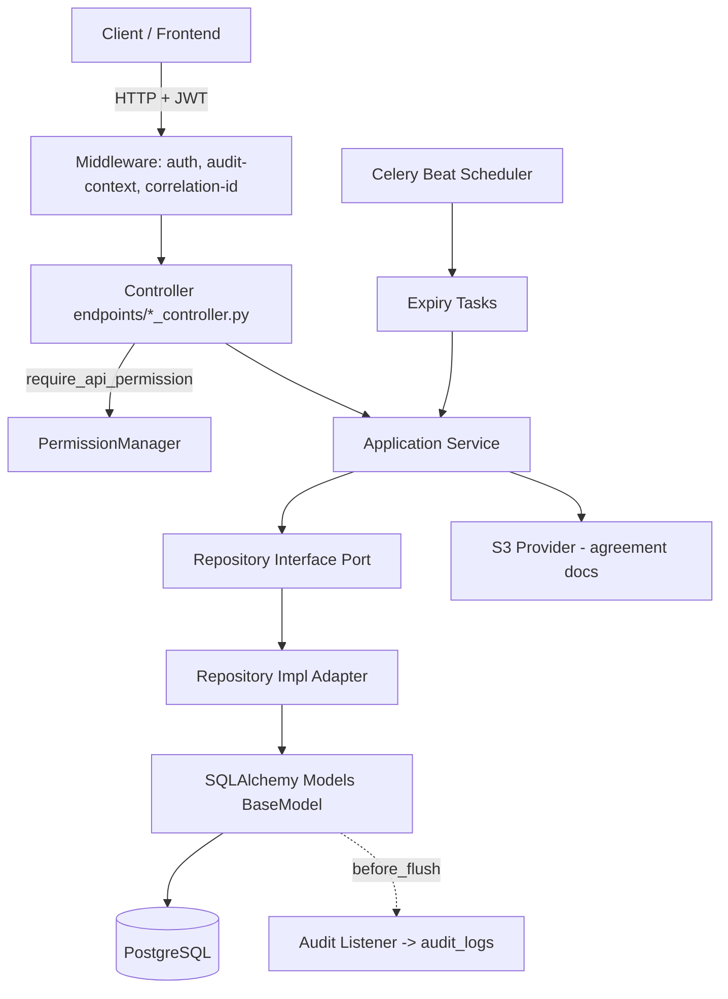
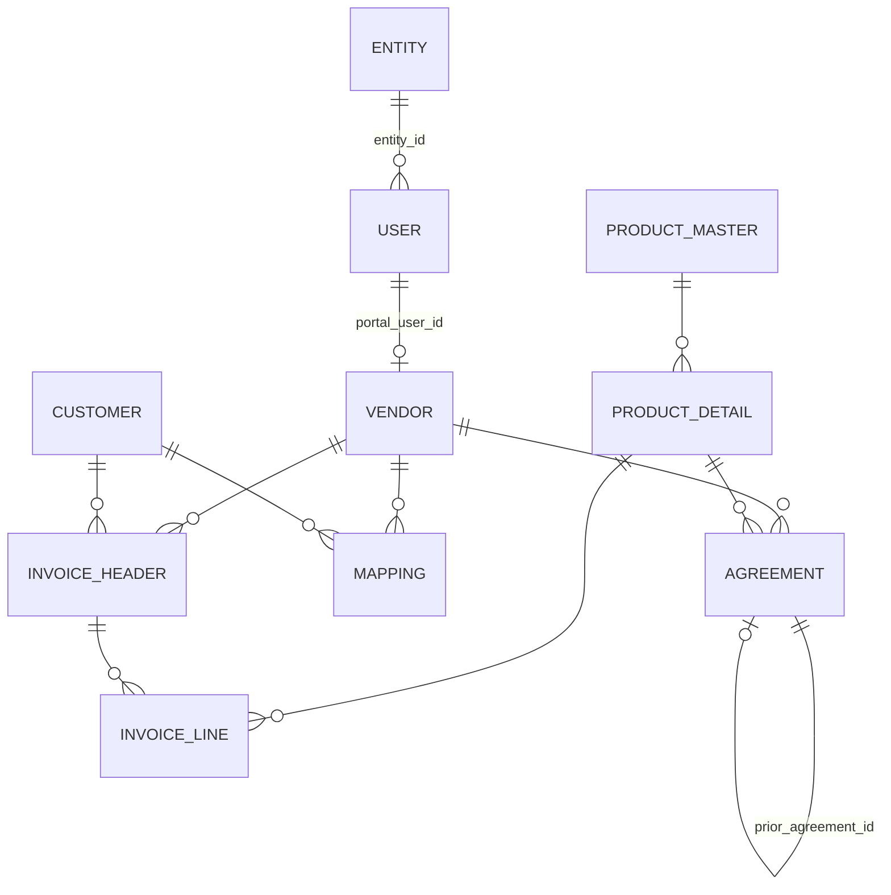

# Design Document

## Overview

This design implements the complete set of LACM master entities — Entity, Vendor, Customer, Product Master, Product Detail, Agreement, Vendor–Customer Mapping, and Invoice (Header + Line) — together with the Claim Validation Triangle, bulk upload, scheduled expiry jobs, and the cross-master relationships described in `MASTERS_SPECIFICATION.md` and the requirements document.

The implementation extends the existing backend's layered Clean Architecture without altering its conventions:

- **Controller layer** (`src/api/v1/endpoints/...`): thin FastAPI routers that validate request schemas, enforce permissions, translate service exceptions into HTTP responses, and delegate to services.
- **Application service layer** (`src/application/services/...`): orchestrates business rules, transactions, cross-entity validation, and audit-context-aware persistence.
- **Domain layer** (`src/domain/entities`, `src/domain/repositories`): dataclass entities inheriting `BaseEntity` (UUID + audit fields) and repository interfaces (Ports).
- **Infrastructure layer** (`src/infrastructure/database/...`): SQLAlchemy ORM models inheriting `BaseModel`/`AuditMixin`, and repository implementations (Adapters).

Key reuse decisions grounded in the existing codebase:

- **Audit fields and audit logging are free.** Every ORM model inherits `BaseModel` (from `base_model.py`), which provides `id` (UUID), `created_by`, `created_date`, `modified_by`, `modified_date`. The `before_flush` listener in `audit_listener.py` automatically writes an `audit_logs` row capturing actor, action (INSERT/UPDATE/DELETE), and old/new values for every `BaseModel` subclass. New master models therefore satisfy Requirement 20.1 with no extra code, as long as the request sets the audit context (already done by `audit_context_middleware.py`).
- **Authentication and authorisation are reused as-is.** `get_current_active_user` (`dependencies.py`) enforces a valid session (Req 20.2). `require_api_permission("<resource>", "<ACTION>")` (`permission_manager.py`) enforces RBAC per endpoint (Req 20.3). No new roles are created — existing roles are referenced by code/ID only.
- **No new User Master or Roles table.** The user-domain work (Requirements 3–5) adds a single nullable `entity_id` FK column to the existing `users` table and layers Create/Edit-User page behaviour onto the existing `UserModel`, `UserDetailsModel`, `RoleModel`, and `RoleAssignmentModel`.
- **Document storage** reuses `infrastructure/external/storage/s3_provider.py` for agreement documents.
- **Scheduled jobs** reuse the existing Celery setup (`celery_app.py`, `schedulers/periodic_tasks.py`).

The technology stack is Python 3.12, FastAPI 0.115, SQLAlchemy 2.0 (async), Pydantic v2, PostgreSQL (asyncpg), Alembic for migrations, Celery for scheduling, and pytest + pytest-asyncio for tests. Hypothesis is proposed for property-based testing.

## Architecture

### Layered request flow



### Module placement

New code follows the existing folder structure. For each master `X`:

| Layer | Path | Contents |
|---|---|---|
| Domain entity | `src/domain/entities/masters/x.py` | `@dataclass` entity extending `BaseEntity` |
| Domain enum | `src/domain/enums/masters.py` | `StrEnum` status/type enums |
| Repository port | `src/domain/repositories/masters/x_repository.py` | `IXRepository(ABC)` |
| ORM model | `src/infrastructure/database/models/masters/x_model.py` | `XModel(BaseModel)` |
| Repository impl | `src/infrastructure/database/repositories/masters/x_repository_impl.py` | `XRepositoryImpl(IXRepository)` |
| Service | `src/application/services/masters/x_service.py` | `XService` |
| Request schemas | `src/api/v1/schemas/masters/x_request.py` | Pydantic v2 request models |
| Response schemas | `src/api/v1/schemas/masters/x_response.py` | Pydantic v2 response models |
| Controller | `src/api/v1/endpoints/masters/x_controller.py` | FastAPI router |

All new controllers are aggregated into `api_v1_router` in `src/api/v1/router.py`.

### Cross-cutting components

- **`MasterValidationError` / `MasterConflictError` / `MasterNotFoundError`**: a small set of application exceptions (added to `src/application/exceptions/application_exceptions.py`) that controllers map to HTTP 422/409/404. Services raise these instead of bare `ValueError` so the field/reason is preserved. (The existing user controller maps `ValueError`; new controllers use the richer exception types but remain backward compatible.)
- **`Claim_Validation_Service`** (`src/application/services/masters/claim_validation_service.py`): pure-logic evaluator of the three-check triangle, consuming Agreement, Mapping, and Invoice repositories.
- **`Bulk_Upload_Service`** (`src/application/services/masters/bulk_upload_service.py`): parses uploaded files, resolves business codes to UUIDs, and delegates per-row to the relevant master service.
- **`Commission_Calculator`** (`src/domain/services/commission_calculator.py`): a pure function implementing the slab rule (Requirement 12), placed in the domain-services layer because it has no I/O.
- **`MasterExpiryScheduler`**: Celery tasks for daily Agreement expiry (Req 13.4) and end-of-day Mapping expiry (Req 15).

### Transaction and audit-context model

Each request runs in a single async DB session/transaction (`get_db_session`). Services perform validation **before** any `session.add`, so rejected requests never flush a partial write (satisfies all "SHALL NOT persist" clauses). Multi-row writes (Invoice header + lines, Agreement renewal) occur within one transaction so they commit or roll back atomically. The audit context (actor identity) is set by middleware for HTTP requests and explicitly set to a `system` actor for scheduler jobs.

## Components and Interfaces

This section specifies the service contracts. Repository interfaces follow the existing `IUserRepository` shape (async methods returning domain entities). Controllers follow the existing thin-controller pattern.

### Entity_Service

```python
class EntityService:
    async def create_entity(self, req: CreateEntityRequest, actor: User) -> EntityResponse: ...
    async def get_entity(self, entity_id: UUID) -> EntityResponse: ...
    async def update_entity(self, entity_id: UUID, req: UpdateEntityRequest, actor: User) -> EntityResponse: ...
    async def list_entities(self, skip: int, limit: int, search: str | None,
                            is_active: bool | None) -> PaginatedResponse[EntityResponse]: ...
    async def get_dropdown(self) -> list[EntityDropdownItem]: ...
```

Behaviour notes:
- Uniqueness checks for Entity Name and Company Code are **trimmed, case-insensitive** (Req 1.3, 1.4) — implemented with `func.lower(func.trim(col)) == value.strip().lower()`.
- Update applies only supplied fields (partial update, Req 1.8); unset fields are distinguished from explicit nulls via Pydantic `model_fields_set`.
- Dropdown returns only `is_active=true` entities (Req 2.1) and formats label as `"{short_code} - {entity_name}"`, substituting `Unknown` for any null/empty/whitespace part (Req 2.3, 2.4).
- Search matches name/short code/company code with a trimmed case-insensitive substring (Req 1.11).

### User_Service (extended)

The existing `UserService` is extended; no new user table is introduced.

```python
class UserService:
    # existing methods retained...
    async def create_user(self, req: CreateUserRequest, actor: User) -> UserResponse: ...   # extended
    async def update_user(self, user_id: UUID, req: EditUserRequest, actor: User) -> UserResponse: ...  # extended
    async def import_users(self, rows: list[HrImportRow], actor: User) -> ImportSummary: ...  # new
```

Behaviour notes:
- Adds `entity_id: UUID | None` to the `User` entity and `UserModel`, validated against an existing **active** Entity (Req 4.5, 5.3).
- Create-user: validates Employee ID + User Name presence/uniqueness, password ≥ 8 unless `validate_with_ad` (Req 4.1–4.4, 4.7), validates roles exist (Req 4.6), assigns roles via existing `RoleAssignmentModel` (Req 4.9, 4.10).
- Edit-user: Employee ID and User Name are read-only (Req 5.1); Change Password optional and only when AD disabled, ≥ 8 chars (Req 5.9–5.11); roles fully replaced (Req 5.5); `is_active=false` blocks login by setting `User.is_active` (Req 5.6, 5.7) — login is already gated by `get_current_active_user`.
- Import: resolves Entity by Company Code (non-empty) else Entity Name, creating the Entity when absent (Req 3.2–3.4); upsert keyed by Employee ID (Req 3.6); rows with neither code nor name produce a row-level error and processing continues (Req 3.5).

### Vendor_Service

```python
class VendorService:
    async def create_vendor(self, req: CreateVendorRequest, actor: User) -> VendorResponse: ...
    async def get_vendor(self, vendor_id: UUID) -> VendorResponse: ...
    async def update_vendor(self, vendor_id: UUID, req: UpdateVendorRequest, actor: User) -> VendorResponse: ...
    async def list_vendors(self, skip: int, limit: int) -> PaginatedResponse[VendorResponse]: ...
    async def deactivate_vendor(self, vendor_id: UUID, actor: User) -> VendorResponse: ...
```

Behaviour notes:
- Creating a vendor provisions a portal-login user (`username = vendor_code`, system-default password, `is_validate_ad=false`) and stores the `portal_user_id` reference, all within one transaction (Req 6.8).
- Email-format and GSTN `[A-Z0-9]{15}` validation on create/update (Req 6.5, 6.6).
- Deactivation sets `status="Inactive"`, then invalidates the portal user's sessions (best-effort) and blocks login by setting the portal user `is_active=false`; if session invalidation fails the deactivation still completes (Req 7.2–7.4, 7.6). Session invalidation targets the existing JWT/session mechanism within 5 seconds (Req 7.3).

### Customer_Service

```python
class CustomerService:
    async def create_customer(self, req, actor) -> CustomerResponse: ...
    async def get_customer(self, customer_id) -> CustomerResponse: ...
    async def update_customer(self, customer_id, req, actor) -> CustomerResponse: ...
    async def list_customers(self, skip, limit) -> PaginatedResponse[CustomerResponse]: ...
    async def delete_customer(self, customer_id, actor) -> None: ...
```

Behaviour notes:
- Customer Type validated against the enum (Req 8.3); GSTN pattern, contact field lengths, and email format validated (Req 8.4, 8.9).
- Delete blocked (409) when referenced by any active Mapping or any Invoice Header (Req 8.6) — checked via repository existence queries before delete.

### Product_Service

```python
class ProductService:
    # masters
    async def create_master(self, req, actor) -> ProductMasterResponse: ...
    async def update_master(self, id, req, actor) -> ProductMasterResponse: ...
    async def get_master(self, id) -> ProductMasterResponse: ...
    async def list_masters(self, skip, limit) -> PaginatedResponse[ProductMasterResponse]: ...
    async def delete_master(self, id, actor) -> None: ...
    # details
    async def create_detail(self, req, actor) -> ProductDetailResponse: ...
    async def update_detail(self, id, req, actor) -> ProductDetailResponse: ...
    async def get_detail(self, id) -> ProductDetailResponse: ...
    async def list_details(self, skip, limit, product_master_id: UUID | None) -> PaginatedResponse[ProductDetailResponse]: ...
```

Behaviour notes:
- Product Detail must reference an existing Product Master (Req 10.4); master delete blocked when children exist (Req 9.5).
- MRP/Rate ≥ 0 and GST % 0–100 validated (Req 10.5, 10.6).
- Detail responses resolve the parent Product Name by traversing Detail → Master (Req 10.10).

### Agreement_Service

```python
class AgreementService:
    async def create_agreement(self, req, actor) -> AgreementResponse: ...
    async def update_agreement(self, id, req, actor) -> AgreementResponse: ...
    async def get_agreement(self, id) -> AgreementResponse: ...
    async def list_agreements(self, skip, limit, vendor_id: UUID | None, actor: User) -> PaginatedResponse[AgreementResponse]: ...
    async def renew_agreement(self, id, req, actor) -> AgreementResponse: ...
    async def expire_due_agreements(self, today: date) -> int: ...   # scheduler entry point
```

Behaviour notes:
- Validates Vendor + Product Detail existence, From ≤ To, Min ≤ Max, percentage ranges 0–100, Slab > 0, Credit Days ≥ 0, document type/size (Req 11.2–11.9). Defaults Type=`Original`, Status=`Active` applied before field validation (Req 11.8).
- Overlap check: rejects when a new/updated active agreement's `[from, to]` (inclusive) overlaps an existing active agreement for the same Vendor + Product Detail; overlap is `a.from <= b.to AND b.from <= a.to` (Req 11.7).
- Renewal: marks prior `Renewed`, creates a `Renewal` record with `prior_agreement_id` set, atomically (Req 13.1, 13.2). Deleting a prior agreement nulls referencing renewals' `prior_agreement_id` (Req 13.3, via `ON DELETE SET NULL`).
- Vendor agents see only their own vendor's agreements (Req 11.10, 20.4) — enforced in the service using the actor's `entity_id`/vendor association.
- Delegates to `Commission_Calculator` for applicable-commission computation (Req 12).

### Mapping_Service

```python
class MappingService:
    async def create_mapping(self, req, actor) -> MappingResponse: ...
    async def update_mapping(self, id, req, actor) -> MappingResponse: ...   # dates only
    async def get_mapping(self, id) -> MappingResponse: ...
    async def list_mappings(self, skip, limit, vendor_id, customer_id, actor) -> PaginatedResponse[MappingResponse]: ...
    async def delete_mapping(self, id, actor) -> None: ...
    async def expire_due_mappings(self, today: date) -> int: ...   # scheduler entry point
```

Behaviour notes:
- Validates Vendor + Customer existence and From ≤ To (Req 14.2, 14.3); overlap check per Vendor + Customer (Req 14.4). Update changes only validity dates (Req 14.6). List filters by vendor and/or customer (Req 14.7) and is vendor-scoped for agents (Req 20.4).

### Invoice_Service

```python
class InvoiceService:
    async def create_invoice(self, req: CreateInvoiceRequest, actor: User) -> InvoiceResponse: ...
    async def get_invoice(self, id) -> InvoiceResponse: ...
    async def update_invoice(self, id, req, actor) -> InvoiceResponse: ...
    async def delete_invoice(self, id, actor) -> None: ...   # cascades lines
    async def record_sap_payment(self, req: SapPaymentConfirmation, actor: User) -> InvoiceResponse: ...
    async def mark_settled(self, invoice_id: UUID, actor: User) -> InvoiceResponse: ...
```

Behaviour notes:
- Header + lines created atomically; Invoice Number unique (Req 16.2); Vendor/Customer/Product Detail existence validated before any persist (Req 16.3, 16.4). Defaults: Amount Deducted=0, TDS=0, Status=`Open` (Req 16.5).
- Due Date: use supplied value if present; else compute Invoice Date + Credit Days from applicable Agreement; else leave unset (Req 16.6–16.8).
- Header delete cascades lines (Req 16.9 via `ON DELETE CASCADE`).
- SAP payment sets Payment Clearing Date + SAP Clearing Document No and Status=`Payment Cleared` (Req 17.1); unknown invoice → not-found (Req 17.4). Final approval sets Status=`Settled` (Req 17.2).

### Claim_Validation_Service

```python
@dataclass
class LineValidationError:
    invoice_line_id: UUID
    code: str          # "NO_ACTIVE_AGREEMENT" | "NO_ACTIVE_MAPPING" | "INVOICE_NOT_CLEARED"
                       # | "AGREEMENT_EXPIRED" | "INVOICE_SETTLED" | "VENDOR_INACTIVE"
    message: str

@dataclass
class LineValidationResult:
    invoice_line_id: UUID
    allowed: bool
    errors: list[LineValidationError]

class ClaimValidationService:
    async def validate_lines(self, invoice_line_ids: list[UUID]) -> list[LineValidationResult]: ...
```

Behaviour notes:
- For each line evaluates **all three** checks independently and returns one distinct error per failed check (Req 18.1–18.3, 18.6). A line is allowed only when all three pass (Req 18.4). Valid and blocked lines coexist in one response without rejecting the whole claim (Req 18.5). Vendor-inactive (Req 7.5), agreement-expired (Req 13.5), and invoice-settled (Req 17.3) are surfaced as specific error codes.

### Bulk_Upload_Service

```python
@dataclass
class BulkRowError:
    row_number: int
    reason: str

@dataclass
class BulkUploadReport:
    received: int
    stored: int
    skipped: int
    errors: list[BulkRowError]

class BulkUploadService:
    async def process(self, entity_type: str, file: UploadFile, actor: User) -> BulkUploadReport: ...
```

Behaviour notes:
- Unparseable file → whole-file rejection, nothing stored (Req 19.2). Each row processed independently (Req 19.1); failed rows skipped with positional error (Req 19.3). Business-code references resolved to UUIDs (Req 19.4); unresolvable codes skipped with a positional error naming the unresolved code (Req 19.5). Returns received/stored/skipped counts + errors (Req 19.6).

### Controller conventions

Each controller mirrors `user_controller.py`: a `_get_x_service` dependency factory, `require_api_permission("<resource>", "<ACTION>")` on each route, `get_current_active_user` for the actor, and exception-to-HTTP mapping (`MasterValidationError`→422, `MasterConflictError`→409, `MasterNotFoundError`→404). Pagination query params use `skip: int = Query(0, ge=0)` and `limit: int = Query(20, ge=1, le=100)` to enforce Req *.9/*.10/*.12 ranges at the boundary.

## Data Models

All ORM models inherit `BaseModel` (UUID PK + audit columns). All enums are `StrEnum` in the domain layer and stored as `String` columns with a `CHECK`/application-level constraint.

### Enums

```python
class VendorStatus(StrEnum):      Active = "Active";   Inactive = "Inactive"
class CustomerStatus(StrEnum):    Active = "Active";   Inactive = "Inactive"
class CustomerType(StrEnum):
    GovernmentMedicalCorporation = "Government Medical Corporation"
    Hospital = "Hospital"; Pharmacy = "Pharmacy"; Institution = "Institution"; Other = "Other"
class ProductStatus(StrEnum):     Active = "Active";   Inactive = "Inactive"
class AgreementType(StrEnum):     Original = "Original"; Renewal = "Renewal"
class AgreementStatus(StrEnum):   Active = "Active"; Expired = "Expired"; Renewed = "Renewed"
class MappingStatus(StrEnum):     Active = "Active"; Expired = "Expired"
class InvoiceStatus(StrEnum):     Open = "Open"; PaymentCleared = "Payment Cleared"; Settled = "Settled"
```

### Entity model

| Column | Type | Constraints |
|---|---|---|
| id | UUID | PK |
| entity_name | String(255) | not null, unique (case-insensitive) |
| short_code | String(50) | nullable |
| company_code | String(50) | nullable, unique (case-insensitive) |
| is_active | Boolean | not null, default true |
| + audit columns | | from `BaseModel` |

`users.entity_id` → `UUID` nullable FK → `entities.id` (`ON DELETE SET NULL`).

### Vendor model

| Column | Type | Constraints |
|---|---|---|
| id | UUID | PK |
| vendor_code | String(50) | not null, unique |
| vendor_name | String(255) | not null |
| vendor_email | String(255) | not null, unique |
| vendor_contact | String(20) | nullable |
| vendor_address | Text | nullable |
| gstn_number | String(15) | nullable, pattern `[A-Z0-9]{15}` |
| pan_number | String(10) | nullable |
| bank_account_no | String(30) | nullable |
| bank_ifsc | String(11) | nullable |
| bank_name | String(100) | nullable |
| portal_user_id | UUID | nullable FK → users.id |
| status | String(20) | not null, default `Active` |

### Customer model

| Column | Type | Constraints |
|---|---|---|
| id | UUID | PK |
| customer_code | String(50) | not null, unique |
| customer_name | String(255) | not null |
| customer_type | String(40) | nullable, enum |
| address | Text | nullable |
| gstn_number | String(15) | nullable, pattern `[A-Z0-9]{15}` |
| contact_person | String(100) | nullable |
| contact_number | String(20) | nullable |
| contact_email | String(255) | nullable, email |
| status | String(20) | not null, default `Active` |

### Product Master / Product Detail models

**ProductMaster**

| Column | Type | Constraints |
|---|---|---|
| id | UUID | PK |
| basic_material_code | String(50) | not null, unique |
| product_name | String(255) | not null |
| therapeutic_category | String(255) | nullable |
| status | String(20) | not null, default `Active` |

**ProductDetail**

| Column | Type | Constraints |
|---|---|---|
| id | UUID | PK |
| child_code | String(50) | not null, unique |
| product_master_id | UUID | not null FK → product_masters.id (`ON DELETE RESTRICT`) |
| variant_description | Text | nullable |
| hsn_code | String(20) | nullable |
| pack_size | String(50) | nullable |
| unit_of_measure | String(20) | nullable |
| mrp | Numeric(12,2) | nullable, ≥ 0 |
| rate | Numeric(12,2) | nullable, ≥ 0 |
| gst_percent | Numeric(5,2) | nullable, 0–100 |
| status | String(20) | not null, default `Active` |

### Agreement model

| Column | Type | Constraints |
|---|---|---|
| id | UUID | PK |
| vendor_id | UUID | not null FK → vendors.id |
| product_detail_id | UUID | not null FK → product_details.id |
| from_date | Date | not null, ≤ to_date |
| to_date | Date | not null, ≥ from_date |
| slab_in_days | Integer | not null, > 0 |
| reduction_percent | Numeric(5,2) | not null, 0–100 |
| max_commission_percent | Numeric(5,2) | not null, 0–100, ≥ min |
| min_commission_percent | Numeric(5,2) | not null, 0–100, ≤ max |
| credit_days | Integer | not null, default 0, ≥ 0 |
| agreement_type | String(20) | not null, default `Original` |
| prior_agreement_id | UUID | nullable FK → agreements.id (`ON DELETE SET NULL`) |
| agreement_document_ref | String(512) | nullable (S3 key) |
| status | String(20) | not null, default `Active` |

Indexed on `(vendor_id, product_detail_id, status)` to support overlap checks.

### Vendor–Customer Mapping model

| Column | Type | Constraints |
|---|---|---|
| id | UUID | PK |
| vendor_id | UUID | not null FK → vendors.id |
| customer_id | UUID | not null FK → customers.id |
| validity_from | Date | not null, ≤ validity_to |
| validity_to | Date | not null, ≥ validity_from |
| status | String(20) | not null, default `Active` |

Indexed on `(vendor_id, customer_id, status)`.

### Invoice Header / Line models

**InvoiceHeader**

| Column | Type | Constraints |
|---|---|---|
| id | UUID | PK |
| invoice_number | String(50) | not null, unique |
| invoice_date | Date | not null |
| vendor_id | UUID | not null FK → vendors.id |
| customer_id | UUID | not null FK → customers.id |
| bill_amount_excl_gst | Numeric(14,2) | not null |
| bill_amount_incl_tax | Numeric(14,2) | nullable |
| amount_deducted | Numeric(14,2) | not null, default 0 |
| tds_value | Numeric(14,2) | not null, default 0 |
| due_date | Date | nullable |
| payment_clearing_date | Date | nullable |
| sap_clearing_document_no | String(50) | nullable |
| invoice_status | String(20) | not null, default `Open` |

**InvoiceLine**

| Column | Type | Constraints |
|---|---|---|
| id | UUID | PK |
| invoice_header_id | UUID | not null FK → invoice_headers.id (`ON DELETE CASCADE`) |
| product_detail_id | UUID | not null FK → product_details.id |
| quantity | Numeric(14,3) | nullable |
| line_amount | Numeric(14,2) | nullable |
| vat_gst_amount | Numeric(14,2) | nullable |

### Entity-relationship diagram



### Shared pagination schema

```python
class PaginatedResponse(BaseModel, Generic[T]):
    items: list[T]
    total: int
    skip: int
    limit: int
```

Added to `src/api/v1/schemas/masters/common.py` (or reusing `common_schema.py`).

## Correctness Properties

*A property is a characteristic or behavior that should hold true across all valid executions of a system — essentially, a formal statement about what the system should do. Properties serve as the bridge between human-readable specifications and machine-verifiable correctness guarantees.*

The properties below were derived from the acceptance-criteria prework. Setup/configuration criteria (audit columns, column existence), pure-infrastructure behaviour (the existing audit listener, auth/permission dependencies), and one-off resilience scenarios are intentionally **not** expressed as properties; they are covered by unit, integration, and smoke tests in the Testing Strategy. Validation-rejection properties are stated once per shape but each master implements its own traceable test.

### Property 1: Entity create/read round-trip with defaults

*For any* valid Entity input (unique trimmed-case-insensitive name and, where supplied, unique company code), creating the Entity and then reading it back returns a record whose supplied fields equal the input and whose `is_active` is `true`.

**Validates: Requirements 1.5, 1.6**

### Property 2: Entity required-field and length validation

*For any* create- or update-Entity request whose Entity Name is missing, empty, or whitespace-only, or whose Entity Name exceeds 255 characters, Short Code exceeds 50 characters, or Company Code exceeds 50 characters, the service rejects the request with a validation error identifying the field and persists/modifies no record.

**Validates: Requirements 1.2**

### Property 3: Entity name/company-code uniqueness is trimmed and case-insensitive

*For any* persisted Entity, a subsequent create whose Entity Name (or Company Code) equals the existing value after trimming and case-folding is rejected with a conflict error, and no second record is stored.

**Validates: Requirements 1.3, 1.4**

### Property 4: Partial update preserves unsupplied fields

*For any* persisted Entity and any partial update patch, fields present in the patch take the new values and every field absent from the patch is left unchanged, while name/company-code uniqueness still holds.

**Validates: Requirements 1.8**

### Property 5: Not-found for unknown identifiers

*For any* UUID not present in a master's store, a read, update, delete, deactivate, or renew operation against that master returns a not-found error and modifies no record. (Applies to Entity, Vendor, Customer, Product Master, Product Detail, Agreement, Mapping, Invoice.)

**Validates: Requirements 1.7, 6.10, 7.1, 8.10, 9.6, 10.8, 11.11, 13.6, 14.9, 17.4**

### Property 6: Pagination returns the requested slice with full total

*For any* dataset and any valid `skip` (≥ 0) and `limit` (1–100), a paginated list returns exactly the records of the dataset slice `[skip, skip+limit)` (under the list's deterministic ordering) and reports `total` equal to the count of all matching records. (Applies to every paginated master list.)

**Validates: Requirements 1.9, 6.11, 8.7, 9.7**

### Property 7: Search returns all and only matching entities

*For any* Entity dataset and any search term of 1–100 characters, the result contains an Entity if and only if its Entity Name, Short Code, or Company Code contains the term using a trimmed case-insensitive substring match.

**Validates: Requirements 1.11**

### Property 8: Active-status filter is exact

*For any* Entity dataset and any active-status filter value, every returned Entity has `is_active` equal to the filter value, and no matching Entity is omitted.

**Validates: Requirements 1.12**

### Property 9: Dropdown contains exactly the active entities

*For any* set of Entities, the dropdown result contains exactly those Entities whose `is_active` is `true` and excludes every inactive Entity.

**Validates: Requirements 2.1**

### Property 10: Dropdown label formatting with Unknown substitution

*For any* active Entity, its dropdown label equals the Short Code, a space, a hyphen, a space, then the Entity Name; and any part (Short Code or Entity Name) that is null, empty, or whitespace-only is rendered as the literal `Unknown`.

**Validates: Requirements 2.3, 2.4**

### Property 11: HR import resolves and links entities correctly

*For any* import row, the referenced Entity is resolved by Company Code when the imported Company Code is non-empty and otherwise by Entity Name; when the resolved Entity does not exist it is created first and the user is linked to the new Entity, and when it already exists the user is linked to the existing Entity without creating a duplicate.

**Validates: Requirements 3.2, 3.3, 3.4**

### Property 12: Import rejects unresolvable rows and continues the batch

*For any* batch of import rows, every row supplying neither a non-empty Company Code nor a non-empty Entity Name is rejected with a logged row-level error, and every other valid row in the batch is still processed.

**Validates: Requirements 3.5**

### Property 13: Import upsert is keyed by Employee ID

*For any* batch of import rows, a row whose Employee ID does not match an existing user creates a user and a row whose Employee ID matches updates that user; importing the same batch twice updates rather than duplicating users.

**Validates: Requirements 3.6**

### Property 14: Create-user validation

*For any* create-user request, the request is rejected and no user is created when the Employee ID or User Name is missing/empty, when the Employee ID or User Name duplicates an existing user, when Validate-with-AD is disabled and the password is absent or shorter than 8 characters, when the Entity reference is not an existing active Entity, or when any supplied Role does not exist.

**Validates: Requirements 4.1, 4.2, 4.3, 4.4, 4.5, 4.6**

### Property 15: Valid user creation stores fields, roles, and entity

*For any* valid create-user request, the created user persists the supplied Employee ID, User Name, Email, First Name, Last Name, and Entity reference; when Validate-with-AD is enabled the user is created without a password; and the user's role assignments equal exactly the supplied (possibly empty) Role set.

**Validates: Requirements 4.7, 4.8, 4.9**

### Property 16: Edit-user preserves identity and validates references

*For any* edit-user request on an existing user, the Employee ID and User Name remain unchanged; the request is rejected without modification when the Entity reference is not an existing active Entity.

**Validates: Requirements 5.1, 5.3**

### Property 17: Valid edit updates mutable fields and replaces roles

*For any* valid edit-user request, the Email, First Name, Last Name, and Entity reference are updated to the supplied values and the user's role assignments are replaced so that the final set equals exactly the supplied Role set, regardless of prior assignments.

**Validates: Requirements 5.4, 5.5**

### Property 18: Deactivation blocks authentication

*For any* user, an edit that sets Is Active to false and is persisted results in the user being unable to authenticate.

**Validates: Requirements 5.6**

### Property 19: Change-password behaviour

*For any* edit-user request with Validate-with-AD disabled: a non-empty Change Password value of at least 8 characters sets the user's password so the new password verifies (without the old password); a non-empty value shorter than 8 characters is rejected with no modification; and an empty value leaves the existing password hash unchanged. Enabling Validate-with-AD updates the user so authentication no longer requires a stored password.

**Validates: Requirements 5.8, 5.9, 5.10, 5.11**

### Property 20: Vendor required-field, format, and uniqueness validation

*For any* create/update-vendor request, the request is rejected with no persist/modify when Vendor Code, Vendor Name, or Vendor Email is missing/empty, when Vendor Code or Vendor Email duplicates an existing vendor, when the Vendor Email is not valid email format, or when the GSTN Number is present and does not match `[A-Z0-9]{15}`.

**Validates: Requirements 6.2, 6.3, 6.4, 6.5, 6.6**

### Property 21: Valid vendor creation defaults status and provisions portal login

*For any* valid create-vendor request, the stored Vendor has Status `Active`, a portal-login user exists whose username equals the Vendor Code with a system-set default password, and the Vendor's Portal User reference points to that user.

**Validates: Requirements 6.7, 6.8**

### Property 22: Deactivation sets Inactive and preserves related data

*For any* existing active Vendor, deactivation sets the Vendor Status to `Inactive`, blocks the portal user from logging in, and leaves all of the Vendor's other records unchanged.

**Validates: Requirements 7.2, 7.6**

### Property 23: Customer validation rules

*For any* create/update-customer request, the request is rejected with no persist/modify when the Customer Code or Customer Name is missing/empty, when the Customer Code duplicates an existing customer, when the Customer Type is outside the allowed enum, when the GSTN Number does not match `[A-Z0-9]{15}`, or when the Contact Person exceeds 100 characters, the Contact Number exceeds 20 characters, or the Contact Email is not valid email format.

**Validates: Requirements 8.2, 8.3, 8.4, 8.8, 8.9**

### Property 24: Valid customer creation defaults status Active

*For any* valid create-customer request, the stored Customer has Status `Active` and its supplied fields are preserved.

**Validates: Requirements 8.5**

### Property 25: Customer deletion is blocked while referenced

*For any* Customer, a delete request is rejected with a conflict error and the Customer is retained when at least one active Vendor–Customer Mapping or Invoice Header references it; when no such reference exists the deletion succeeds.

**Validates: Requirements 8.6**

### Property 26: Product Master validation and default

*For any* create/update Product Master request, the request is rejected when the Basic Material Code or Product Name is missing/empty or when the Basic Material Code duplicates an existing master; a valid create stores Status `Active`.

**Validates: Requirements 9.2, 9.3, 9.4**

### Property 27: Product Master deletion blocked when children exist

*For any* Product Master, a delete request is rejected with a conflict error and the master and its children are retained when it has one or more Product Detail children; with no children the deletion succeeds.

**Validates: Requirements 9.5**

### Property 28: Product Detail validation and default

*For any* create/update Product Detail request, the request is rejected with no persist/modify when the Child Code or Product Master reference is missing/empty, when the Child Code duplicates an existing detail, when the referenced Product Master does not exist, when MRP or Rate is below 0, or when GST % is outside 0–100; a valid create stores Status `Active`.

**Validates: Requirements 10.2, 10.3, 10.4, 10.5, 10.6, 10.7**

### Property 29: Product Detail master filter

*For any* Product Detail dataset and any `product_master_id` filter, every returned Product Detail belongs to that Product Master and no belonging detail is omitted.

**Validates: Requirements 10.9**

### Property 30: Product name resolves through the hierarchy

*For any* Product Detail, the product name resolved for downstream display equals the Product Name of the Detail's parent Product Master.

**Validates: Requirements 10.10**

### Property 31: Agreement field validation

*For any* create/update Agreement request, the request is rejected when the referenced Vendor or Product Detail does not exist, when From Date is later than To Date, when Min Commission % exceeds Max Commission %, when Reduction %, Max %, or Min % is outside 0–100, when Slab in Days is not greater than 0 or Credit Days is below 0, or when the Agreement Document is not PDF/JPEG/PNG or exceeds 10 MB.

**Validates: Requirements 11.2, 11.3, 11.4, 11.5, 11.6, 11.9**

### Property 32: Agreement defaults applied before validation

*For any* valid create-Agreement request that omits Agreement Type and Status, the stored Agreement has Agreement Type `Original` and Status `Active`.

**Validates: Requirements 11.8**

### Property 33: No overlapping active agreements per vendor + product detail

*For any* two agreement validity periods for the same Vendor and Product Detail, attempting to create/update the second as active is rejected with a conflict error if and only if the periods overlap, where two inclusive periods overlap exactly when each period's From Date is on or before the other period's To Date.

**Validates: Requirements 11.7**

### Property 34: Agreement vendor-scoped listing

*For any* agreement dataset and any `vendor_id` filter, the result contains only agreements belonging to that Vendor; and for any vendor-agent actor the result contains only agreements belonging to the agent's own Vendor.

**Validates: Requirements 11.10, 20.4**

### Property 35: Commission slab calculation is correct and bounded

*For any* Agreement parameters and any Delay Days value: when Delay Days ≤ 0 the Applicable Commission % equals Max Commission %; when Delay Days > 0 it equals `max(Max% − ceil(DelayDays ÷ SlabInDays) × Reduction%, Min%)`; and in all cases the result lies within the inclusive range [Min %, Max %].

**Validates: Requirements 12.1, 12.2**

### Property 36: Delay Days equals the day difference

*For any* Due Date and Payment Clearing Date, the computed Delay Days equals the number of whole calendar days from the Due Date to the Payment Clearing Date (Clearing − Due).

**Validates: Requirements 12.3**

### Property 37: Renewal marks prior and links new agreement

*For any* existing Agreement, a renew operation sets the prior Agreement's Status to `Renewed` and creates a new Agreement of type `Renewal` whose Prior Agreement reference points to the prior Agreement.

**Validates: Requirements 13.1, 13.2**

### Property 38: Deleting a prior agreement nulls renewal references

*For any* renewal chain, deleting the prior Agreement sets the referencing Renewal Agreement's Prior Agreement reference to null while retaining the Renewal Agreement.

**Validates: Requirements 13.3**

### Property 39: Daily job expires only past-due active agreements

*For any* set of Agreements and any current date, the daily expiry job sets Status to `Expired` for exactly those Agreements whose Status is `Active` and whose To Date is earlier than the current date, and leaves all other Agreements unchanged.

**Validates: Requirements 13.4**

### Property 40: Mapping validation and default

*For any* create/update Mapping request, the request is rejected with no persist/modify when the referenced Vendor or Customer does not exist or when Validity From is later than Validity To; a valid create stores Status `Active`.

**Validates: Requirements 14.2, 14.3, 14.5**

### Property 41: No overlapping active mappings per vendor + customer

*For any* two mapping validity periods for the same Vendor and Customer, creating/updating the second as active is rejected with a conflict error if and only if the inclusive periods overlap.

**Validates: Requirements 14.4**

### Property 42: Mapping update changes only validity dates

*For any* existing Mapping and any update request, only Validity From and Validity To change to the supplied values and all other fields, including Status, remain unchanged.

**Validates: Requirements 14.6**

### Property 43: Mapping filtering by vendor and/or customer

*For any* mapping dataset and any combination of `vendor_id` and/or `customer_id` filters, the result contains exactly the Mappings matching all supplied filters.

**Validates: Requirements 14.7**

### Property 44: End-of-day job expires only past-due active mappings

*For any* set of Mappings and any current date, the end-of-day expiry job sets Status to `Expired` for exactly those active Mappings whose Validity To is earlier than the current date and leaves unchanged every active Mapping whose Validity To is on or after the current date.

**Validates: Requirements 15.1, 15.2**

### Property 45: Invoice creation is atomic and validated

*For any* create-Invoice request, nothing (neither header nor any line) is persisted when the Invoice Number duplicates an existing header, when the referenced Vendor or Customer does not exist, or when any Invoice Line references a non-existent Product Detail.

**Validates: Requirements 16.2, 16.3, 16.4**

### Property 46: Valid invoice creation defaults and due-date computation

*For any* valid create-Invoice request, the stored header has Amount Deducted 0, TDS Value 0, and Status `Open`; the Due Date equals the supplied value when supplied, otherwise Invoice Date + Credit Days from the applicable Agreement when such an Agreement exists, otherwise remains unset.

**Validates: Requirements 16.5, 16.6, 16.7**

### Property 47: Deleting an invoice header removes its lines

*For any* Invoice Header with lines, deleting the header results in none of its Invoice Lines remaining.

**Validates: Requirements 16.9**

### Property 48: Invoice status transitions

*For any* existing Invoice Header, recording a SAP payment confirmation sets the Payment Clearing Date and SAP Clearing Document No to the supplied values and the Status to `Payment Cleared`; reaching final claim approval sets the Status to `Settled`.

**Validates: Requirements 17.1, 17.2**

### Property 49: Claim Validation Triangle decides line eligibility

*For any* invoice line, the line is allowed if and only if an active Agreement for its Vendor and Product Detail covers the invoice date (inclusive), an active Vendor–Customer Mapping for its Vendor and Customer covers the invoice date (inclusive), and the Invoice Header Status is `Payment Cleared`; otherwise the line is blocked. A vendor that is Inactive, an agreement whose To Date precedes the invoice date, and an invoice that is Settled each cause the line to be blocked with its specific error.

**Validates: Requirements 7.5, 13.5, 17.3, 18.1, 18.2, 18.3, 18.4**

### Property 50: Claim validation is per-line independent

*For any* set of invoice lines submitted together, the set of allowed lines equals exactly the lines that individually pass all three checks; valid lines proceed and only invalid lines are blocked, without rejecting the whole claim.

**Validates: Requirements 18.5**

### Property 51: Each failed check yields one distinct error

*For any* invoice line that fails k of the three triangle checks (Agreement, Mapping, Invoice Status), validation returns exactly k distinct errors, one for each failed check.

**Validates: Requirements 18.6**

### Property 52: Bulk upload row accounting and independence

*For any* bulk-upload file that parses, each row is processed independently: valid rows are stored, rows failing validation or referencing an unresolvable Business Code are skipped with a positional row-level error (naming the unresolved code where applicable), resolvable Business Codes are converted to UUIDs before storing, and the final report satisfies `received == stored + skipped` with exactly one error entry per skipped row.

**Validates: Requirements 19.1, 19.3, 19.4, 19.5, 19.6**

### Property 53: Unparseable bulk file stores nothing

*For any* bulk-upload file that does not conform to the expected structure and cannot be parsed, the entire file is rejected and no row is stored.

**Validates: Requirements 19.2**

## Error Handling

### Exception taxonomy

Services raise typed application exceptions (added to `src/application/exceptions/application_exceptions.py`); controllers map them to HTTP responses. This extends the existing pattern where controllers catch `ValueError`.

| Exception | Meaning | HTTP status | Source requirements |
|---|---|---|---|
| `MasterValidationError(field, reason)` | Required/format/range/reference validation failed | 422 Unprocessable Entity | 1.2, 1.10, 6.2/6.5/6.6, 8.x, 9.2, 10.x, 11.2–11.9, 14.2/14.3, 16.3/16.4 |
| `MasterConflictError(detail)` | Uniqueness or overlap or in-use conflict | 409 Conflict | 1.3, 1.4, 4.2, 4.3, 6.3, 6.4, 8.2, 8.6, 9.3, 9.5, 10.3, 11.7, 14.4, 16.2 |
| `MasterNotFoundError(resource, id)` | Referenced record does not exist | 404 Not Found | 1.7, 6.10, 7.1, 8.10, 9.6, 10.8, 11.11, 13.6, 14.9, 17.4 |
| (existing auth) `HTTPException 401` | No valid session | 401 Unauthorized | 20.2 |
| (existing RBAC) `HTTPException 403` | Missing permission | 403 Forbidden | 20.3 |

Each error response carries a stable machine-readable shape: `{ "detail": <message>, "field": <field?>, "code": <code?> }`, consistent with the existing error-response conventions in `common_schema.py` / `exception_handler.py`.

### Validation ordering and atomicity

- **Validate before persist.** Every service performs all field validation, reference-existence checks, uniqueness checks, and overlap checks **before** calling `session.add`. This guarantees the many "SHALL NOT persist or modify" clauses: a rejected request never leaves a partial write because nothing is flushed.
- **Atomic multi-row writes.** Invoice header + lines and agreement renewal (prior update + new insert) run in a single transaction. If any line/step fails validation, the whole request is rejected and the transaction rolls back, satisfying Req 16.4 and 13.1/13.2 atomicity.
- **Defaults before validation.** Agreement create applies `Original`/`Active` defaults before field validation (Req 11.8) so validation sees the effective values.

### Partial-failure handling

- **Bulk upload** never aborts the batch on a row error (except an unparseable file, Req 19.2). Each row is validated and stored in its own savepoint (nested transaction); a failing row is rolled back to the savepoint and recorded as a `BulkRowError`, leaving previously stored rows intact (Req 19.1, 19.3).
- **HR import** mirrors this: a bad row is logged and skipped, others continue (Req 3.5).
- **Claim validation** evaluates all three checks for every line and aggregates per-line results so valid lines proceed while invalid lines are blocked with one error per failed check (Req 18.5, 18.6).

### Scheduler error handling

The Agreement daily job and Mapping end-of-day job run inside a transaction. On failure the transaction rolls back, leaving affected records unchanged, and Celery's retry/next-scheduled-run re-attempts the expiry (Req 15.3). Jobs are **idempotent**: re-running only transitions records still matching the `Active` + past-due predicate, so a partial prior run causes no double effect.

### Vendor deactivation resilience

Deactivation persists the `Inactive` status first, then attempts portal-session invalidation. If invalidation raises, the error is caught and logged but the deactivation transaction still commits (Req 7.4); the portal user's `is_active=false` flag independently guarantees future logins are blocked.

## Testing Strategy

### Dual approach

- **Property-based tests** verify the 53 universal properties above across generated inputs. They target the business logic that varies meaningfully with input: validation, uniqueness, interval overlap, commission calculation, claim validation, pagination, filtering, and expiry.
- **Unit tests** cover concrete examples, specific edge cases, and error scenarios that are not universal.
- **Integration / smoke tests** cover infrastructure wiring that does not vary with input.

### Property-based testing

- **Library:** [Hypothesis](https://hypothesis.readthedocs.io/) (the standard Python PBT library) added to the `dev` optional-dependencies in `pyproject.toml`. Property tests are **not** hand-rolled.
- **Iterations:** each property test runs a minimum of 100 examples (`@settings(max_examples=100)`).
- **Tagging:** each property test is tagged with a comment referencing its design property, in the format:
  `# Feature: lacm-masters, Property {number}: {property_text}`
- **Coverage:** every property (1–53) is implemented by a **single** property-based test.
- **Generators / strategies:**
  - Reusable Hypothesis strategies are defined for each master's valid input (e.g. `valid_entity()`, `valid_vendor()`, `valid_agreement_params()`) and for invalid variants (whitespace-only strings, over-length strings via `st.text(min_size=N)`, malformed emails, GSTN strings that violate `[A-Z0-9]{15}`, out-of-range numerics, MRP/Rate < 0, GST% outside 0–100).
  - Date-interval strategies generate `(from, to)` pairs with `from <= to` plus deliberately overlapping and non-overlapping pairs to exercise Properties 33 and 41.
  - Commission strategy generates `(max%, min%, reduction%, slab_days, delay_days)` tuples with `min <= max` to exercise Property 35 (including the `[Min, Max]` bound invariant and the `delay <= 0` branch).
  - Edge cases from the prework (empty active set for dropdown, empty filter results, no-roles user, no-agreement due-date) are folded into the relevant strategies.
- **Isolation for DB-touching properties:** repository/service properties run against an in-memory/throwaway transactional session (SQLite-compatible logic or a per-example rolled-back PostgreSQL transaction) so 100+ iterations stay fast and side-effect-free. Pure-logic properties (commission calculation Property 35/36, dropdown label Property 10, interval-overlap predicate, triangle decision Property 49) are tested directly against pure functions with no I/O, which is the cheapest and most valuable PBT target.

### Property-to-requirement traceability

| Property | Requirements | Property | Requirements |
|---|---|---|---|
| 1 | 1.5, 1.6 | 28 | 10.2–10.7 |
| 2 | 1.2 | 29 | 10.9 |
| 3 | 1.3, 1.4 | 30 | 10.10 |
| 4 | 1.8 | 31 | 11.2–11.6, 11.9 |
| 5 | 1.7, 6.10, 7.1, 8.10, 9.6, 10.8, 11.11, 13.6, 14.9, 17.4 | 32 | 11.8 |
| 6 | 1.9, 6.11, 8.7, 9.7 | 33 | 11.7 |
| 7 | 1.11 | 34 | 11.10, 20.4 |
| 8 | 1.12 | 35 | 12.1, 12.2 |
| 9 | 2.1 | 36 | 12.3 |
| 10 | 2.3, 2.4 | 37 | 13.1, 13.2 |
| 11 | 3.2, 3.3, 3.4 | 38 | 13.3 |
| 12 | 3.5 | 39 | 13.4 |
| 13 | 3.6 | 40 | 14.2, 14.3, 14.5 |
| 14 | 4.1–4.6 | 41 | 14.4 |
| 15 | 4.7, 4.8, 4.9 | 42 | 14.6 |
| 16 | 5.1, 5.3 | 43 | 14.7 |
| 17 | 5.4, 5.5 | 44 | 15.1, 15.2 |
| 18 | 5.6 | 45 | 16.2, 16.3, 16.4 |
| 19 | 5.8–5.11 | 46 | 16.5, 16.6, 16.7 |
| 20 | 6.2–6.6 | 47 | 16.9 |
| 21 | 6.7, 6.8 | 48 | 17.1, 17.2 |
| 22 | 7.2, 7.6 | 49 | 7.5, 13.5, 17.3, 18.1–18.4 |
| 23 | 8.2, 8.3, 8.4, 8.8, 8.9 | 50 | 18.5 |
| 24 | 8.5 | 51 | 18.6 |
| 25 | 8.6 | 52 | 19.1, 19.3, 19.4, 19.5, 19.6 |
| 26 | 9.2, 9.3, 9.4 | 53 | 19.2 |
| 27 | 9.5 | | |

### Unit, edge-case, integration, and smoke tests

These cover criteria the prework classified as non-property:

- **EDGE_CASE** (folded into property generators but also asserted explicitly): out-of-range pagination params rejected at the FastAPI `Query` boundary (1.10, 6.12); empty dropdown when no active entities (2.2); no-roles user → zero assignments (4.10); empty mapping list (14.8); unset due date with no agreement (16.8).
- **EXAMPLE / scenario unit tests:** pre-commit deactivated user still authenticates (5.7); vendor deactivation completes when session invalidation throws (7.4); scheduler retries on failure leaving data unchanged (15.3); missing-token → 401 (20.2); insufficient-permission → 403 (20.3).
- **INTEGRATION tests (1–3 examples each):** automatic audit-log entry with old/new values written by the existing `before_flush` listener on master CRUD (20.1); vendor portal-session invalidation calls the session store and blocks login within the time budget (7.3).
- **SMOKE tests (single execution):** each new model creates its table with the UUID PK and audit columns and persists/reads back (1.1, 6.1, 8.1, 9.1, 10.1, 11.1, 14.1, 16.1); `users.entity_id` column exists and is nullable (3.1); Alembic migration for all new tables applies cleanly.

### Tooling and gates

- Tests run under `pytest` with `pytest-asyncio` (`asyncio_mode = "auto"`, already configured).
- `pytest-cov` enforces coverage on the new `masters` packages.
- `ruff` and `mypy --strict` (already configured) must pass for all new modules.
- A new Alembic migration under `infrastructure/database/migrations/versions/` creates all master tables, FKs (`ON DELETE` rules as specified), unique indexes, and the `users.entity_id` column; a migration smoke test verifies upgrade/downgrade.

### Out of scope for automated testing

The visual/feel aspects of the front-end User pages and the precise 5-second session-invalidation latency under production load are validated through manual/operational testing rather than automated tests; the logic they depend on (status flags, blocking rules) is covered by the properties and integration tests above.
