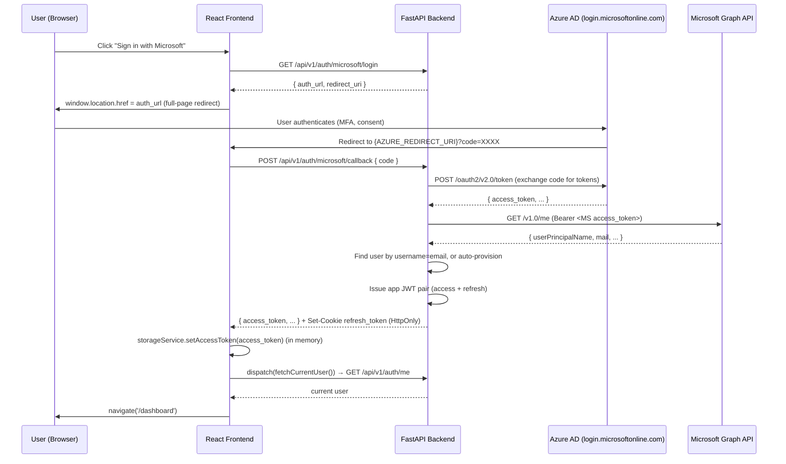

# Microsoft OAuth2 / Azure AD SSO — Implementation Reference

**Status:** Implemented (Frontend + Backend).

This document previously described a different project entirely (`emcatalyst-migration`,
with a `backend/app/...`, `routers/`, `core/config.py` layout and a `frontend/src/features/auth/...`
folder). None of those paths exist here. It has been rewritten against this repo's actual
`backend/src/...` layout and `frontend/src/features/authentication/...` folder — verify
paths below against the source tree if this drifts again.

---

## Executive Summary

This application supports Microsoft Azure AD Single Sign-On using the **OAuth2
Authorization Code flow**, without PKCE, using a confidential client (`client_secret` held
server-side only). The implementation spans the React frontend and FastAPI backend.

---

## Architecture Overview



---

## Technology Stack

| Layer | Technology |
|-------|-----------|
| Identity Provider | Azure Active Directory (Microsoft Entra ID) |
| Protocol | OAuth2 Authorization Code Grant, no PKCE |
| Backend HTTP | `httpx` (async), imported lazily inside `exchange_code_for_profile` |
| Token Storage (FE) | In-memory only, via `storageService` (never localStorage/sessionStorage) |
| Refresh Token | HttpOnly, path-scoped, `SameSite` cookie, set by the backend |
| App Tokens | JWT signed with `JWT_ALGORITHM` (HS256 by default), issued by `JWTProvider` |

---

## Environment Variables

Defined in `src/config/settings.py`, overridable via `.env`:

```env
AZURE_CLIENT_ID=<Application (client) ID from Azure App Registration>
AZURE_CLIENT_SECRET=<Client secret value>
AZURE_TENANT_ID=<Directory (tenant) ID>
AZURE_REDIRECT_URI=http://localhost:6769/auth/microsoft/callback
```

`AZURE_REDIRECT_URI` defaults to `http://localhost:6769/auth/microsoft/callback` if unset
(`AzureSsoClient.__init__`) — note the port matches this project's dev frontend
(`vite.config.ts` / `dev.ps1`, port 6769), not a generic `5173`.

---

## Backend Implementation

### `src/infrastructure/external/azure_sso/azure_client.py`

**Class: `AzureSsoClient`**

| Member | Purpose |
|--------|---------|
| `is_configured` | `True` when both `AZURE_CLIENT_ID` and `AZURE_TENANT_ID` are set |
| `build_authorization_url()` | Returns `(auth_url, redirect_uri)`. Scopes: `openid profile email User.Read`. `prompt=select_account` |
| `exchange_code_for_profile(code)` | POSTs to Azure's `/oauth2/v2.0/token`, then GETs `https://graph.microsoft.com/v1.0/me` with the resulting Microsoft access token. Returns the raw Graph profile dict. |

**Error hierarchy** (`src/infrastructure/external/azure_sso/__init__.py` re-exports all of
these): `AzureSsoError` (base) → `AzureTokenMissingError` (token endpoint responded with no
`access_token`), `AzureAuthError` (Microsoft returned an HTTP error status; carries
`.detail`), `AzureUnavailableError` (Microsoft unreachable — `httpx.RequestError`).

There is **no separate `state` or `nonce` parameter** generated or validated on this flow —
see Security Considerations below.

### `src/api/v1/endpoints/auth_controller.py`

The Microsoft endpoints live in the same controller as local login/logout/refresh — there
is no dedicated `routers/auth.py` or `microsoft_controller.py` file.

#### `GET /api/v1/auth/microsoft/login`

```json
{
  "auth_url": "https://login.microsoftonline.com/{tenant}/oauth2/v2.0/authorize?...",
  "redirect_uri": "http://localhost:6769/auth/microsoft/callback"
}
```

Returns `501 Not Implemented` if `AzureSsoClient.is_configured` is `False`.

#### `POST /api/v1/auth/microsoft/callback`

```json
Request: { "code": "0.AXkA..." }
Response: {
  "access_token": "eyJ...",
  "token_type": "Bearer",
  "expires_in": 1800
}
```

(No `refresh_token` field in the JSON body — it's delivered via `Set-Cookie`, same as local
login. `response_model=TokenResponse, response_model_exclude_none=True` on this route, same
schema local login uses.)

**Actual callback flow** (`microsoft_callback` in `auth_controller.py`):

1. Validate `AzureSsoClient.is_configured`; `501` if not.
2. Require a non-empty `code` in the request body; `400` if missing.
3. `client.exchange_code_for_profile(code)` → Microsoft Graph profile dict. Maps
   `AzureTokenMissingError`/`AzureAuthError` → `400`, `AzureUnavailableError` → `502`.
4. Extract `email = (profile.get("mail") or profile.get("userPrincipalName") or "").lower().strip()`.
   `400` if there's no email at all.
5. **Look up the local user by `username == email` only** — `user_repo.get_by_username(email)`.
   There is no separate employee-id lookup step; `username` and `email` are the same
   lookup key for SSO users in this codebase.
6. If not found: auto-provision a new `User` with `username=email`,
   `password_hash=hash_password(secrets.token_urlsafe(32))` (a random password the user
   never uses), `is_active=True`, `is_blocked=False`, `created_by="microsoft_sso"`. Note:
   `is_validate_ad` is left at its column default (`True`) rather than being set explicitly —
   this doesn't matter for the SSO path itself (no local-vs-AD branch runs here), but it does
   mean an auto-provisioned SSO user would validate against Darwin AD, not locally, if they
   later tried the regular username/password login form with the same username.
7. `403` if the resolved user is inactive or blocked.
8. Issue a JWT pair via `JWTProvider` (not a `JwtService.create_token_pair()` — that class
   name doesn't exist in this codebase), set the refresh token as an HttpOnly cookie via the
   same `_set_refresh_cookie()` helper local login uses, and return the access token.

No role is assigned on auto-provision — same as the manual employee-import flow, since
`users` has no `role` column (see [VALIDATE_AD_IMPLEMENTATION.md](./VALIDATE_AD_IMPLEMENTATION.md)).
An auto-provisioned SSO user has **no permissions at all** until an administrator assigns a
role via `POST /api/v1/rbac/assignments`.

---

## Frontend Implementation

### `frontend/src/features/authentication/api/microsoftApi.ts`

```typescript
export const microsoftApi = {
  getLoginUrl: async (): Promise<MicrosoftLoginUrlResponse> => { /* GET /auth/microsoft/login */ },
  exchangeCode: async (code: string): Promise<TokenResponse> => { /* POST /auth/microsoft/callback */ },
};
```

This is a distinct file from `authApi.ts` (which only handles `/auth/login`, `/refresh`,
`/me`, `/logout`) — not one shared file exporting bare `getMicrosoftLoginUrl()` /
`microsoftCallback()` functions. `microsoftApi` is an object with two methods.

### `frontend/src/features/authentication/pages/LoginPage.tsx`

Renders the "Sign in with Microsoft" button. On click, calls `microsoftApi.getLoginUrl()`
and does a full-page redirect: `window.location.href = res.auth_url`.

### `frontend/src/features/authentication/pages/MicrosoftCallbackPage.tsx`

Handles the Azure redirect back:

1. Reads `code` (and `error` / `error_description`) from the URL query string via
   `useSearchParams()`.
2. Calls `microsoftApi.exchangeCode(code)`.
3. `storageService.setAccessToken(tokenRes.access_token)` — stores the access token in
   memory.
4. `dispatch(fetchCurrentUser())` — an `authSlice` thunk that fetches the profile, loads
   RBAC permissions, and broadcasts the login to other tabs.
5. Navigates to `sessionStorage.getItem('redirectAfterLogin') ?? '/dashboard'`, then clears
   that key.
6. On error, shows an error card with a "Back to Login" button rather than the spinner.

Files/paths are under `pages/`, not a `components/` subfolder — `authentication/components/`
exists but is empty scaffolding (`.gitkeep` only).

### Token storage: `frontend/src/shared/services/storageService.ts`

There is **no `tokenManager.ts` file in this project** (that name/pattern exists in sibling
repos in this workspace — `catalyst`, `RWE_Module`, `develop-jenkin-01` — not here). The
actual mechanism is `storageService`, a plain module-level `let accessToken: string | null`
with `getAccessToken` / `setAccessToken` / `clearAccessToken` / `isAuthenticated`. It does
not itself implement proactive refresh or a queued single-flight refresh — that logic lives
in `frontend/src/shared/services/apiClient.ts`'s `refreshAccessTokenOnce()` (a 401-triggered,
de-duplicated refresh, shared by `authApi.refresh()`) and in the `authSlice`'s
`bootstrapSession` thunk (session restore on page load, using the refresh cookie).

---

## Azure App Registration Setup

1. **Azure Portal** → Azure Active Directory → App Registrations → New Registration
2. **Redirect URI:** whatever `AZURE_REDIRECT_URI` is configured to (type: Web) — for local
   dev, `http://localhost:6769/auth/microsoft/callback`
3. **API Permissions:** `User.Read` (Microsoft Graph, Delegated)
4. **Certificates & Secrets:** create a client secret → copy the **Value** into
   `AZURE_CLIENT_SECRET`
5. From the app's Overview blade: Application (client) ID → `AZURE_CLIENT_ID`; Directory
   (tenant) ID → `AZURE_TENANT_ID`

---

## Security Considerations

| Aspect | Implementation |
|--------|---------------|
| Client Type | Confidential — `AZURE_CLIENT_SECRET` is read server-side only (`settings.py`), never sent to the frontend |
| PKCE | Not used |
| Token Storage (frontend) | In-memory only via `storageService` — XSS-resistant |
| Refresh Token | HttpOnly cookie, set by the same `_set_refresh_cookie()` helper as local login, scoped to `settings.REFRESH_COOKIE_PATH` |
| User Provisioning | Auto-creates a local user on first SSO login, keyed by email, with no role assigned |
| Auto-provisioned password | Random 32-byte URL-safe token via `secrets.token_urlsafe(32)`, hashed — never surfaced to the user |
| Inactive/blocked users | Rejected with `403` after profile lookup, same as local login |
| `state` parameter | **Not implemented** — `build_authorization_url()` does not generate one, and the callback does not validate one. This is a real CSRF gap on the callback endpoint in this codebase today, not a hypothetical. |
| `nonce` / `id_token` validation | Not implemented — the flow never requests or inspects an `id_token`; it relies on the Graph `/me` call after code exchange instead |

### Suggestions if hardening this flow

1. Add a `state` parameter to `build_authorization_url()`, store it (e.g. in a short-lived
   signed cookie or server-side cache keyed by a request id), and validate it in
   `microsoft_callback` before exchanging the code — this is the one concrete, currently-real
   gap in an otherwise conventional confidential-client flow.
2. Rate-limit `POST /api/v1/auth/microsoft/callback` — nothing currently throttles repeated
   code-exchange attempts.
3. Log SSO-specific audit events (successful SSO login, failed code exchange, user
   auto-provisioned via SSO) the way `AuditService.log_login` does for local login —
   currently the Microsoft callback path does not call `AuditService` at all, so SSO logins
   don't appear in the login-history audit trail the way local logins do.

---

## Route Configuration (Frontend)

Registered in `frontend/src/app/router/AppRouter.tsx`, alongside `/login`, outside the
`<PrivateRoute>`-guarded section — no auth guard, since the user has not authenticated with
this app yet when Azure redirects back:

```tsx
<Route path="/auth/microsoft/callback" element={<MicrosoftCallbackPage />} />
```

This matches the default `AZURE_REDIRECT_URI` path component
(`http://localhost:6769/auth/microsoft/callback`). If `AZURE_REDIRECT_URI` is changed in
`.env`, this route must be updated to match, and the Azure App Registration's redirect URI
must match both.

---

## Files Reference

| Path | Purpose |
|------|---------|
| `backend/src/infrastructure/external/azure_sso/azure_client.py` | `AzureSsoClient` — build auth URL, exchange code, fetch Graph profile |
| `backend/src/infrastructure/external/azure_sso/__init__.py` | Re-exports the client and its exception hierarchy |
| `backend/src/api/v1/endpoints/auth_controller.py` | `microsoft_login` / `microsoft_callback` route handlers (alongside local login/logout/refresh) |
| `backend/src/config/settings.py` | `AZURE_CLIENT_ID`, `AZURE_CLIENT_SECRET`, `AZURE_TENANT_ID`, `AZURE_REDIRECT_URI` |
| `frontend/src/features/authentication/api/microsoftApi.ts` | `microsoftApi.getLoginUrl()`, `microsoftApi.exchangeCode()` |
| `frontend/src/features/authentication/pages/LoginPage.tsx` | "Sign in with Microsoft" button handler |
| `frontend/src/features/authentication/pages/MicrosoftCallbackPage.tsx` | OAuth callback page |
| `frontend/src/features/authentication/store/authSlice.ts` | `fetchCurrentUser`, `bootstrapSession` thunks |
| `frontend/src/shared/services/storageService.ts` | In-memory access-token store |
| `frontend/src/shared/services/apiClient.ts` | Axios client; `refreshAccessTokenOnce()` de-duplicated refresh + 401 interceptor |
